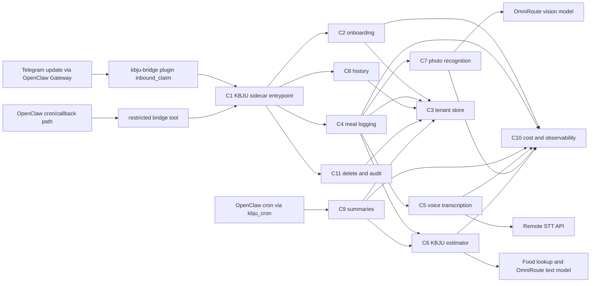

# ARCH-001: KBJU Coach v0.1

## 0. Recon Report (Phase 0 — MANDATORY before any design)

> Required input: `docs/knowledge/openclaw.md`, `docs/knowledge/awesome-skills.md`. Reviewer rejects ArchSpecs that skip this section.

### 0.1 OpenClaw capability map

Sources audited before design: local runtime notes in `docs/knowledge/openclaw.md`, skill catalogue notes in `docs/knowledge/awesome-skills.md`, OpenClaw docs (<https://docs.openclaw.ai>), OpenClaw source/README (<https://github.com/openclaw/openclaw>), and the public skills catalogue (<https://github.com/VoltAgent/awesome-openclaw-skills>). OpenClaw remains locked by PRD-001@0.2.0 §7; this map identifies only what the runtime closes and what remains project-owned.

| PRD requirement | OpenClaw built-in that closes infrastructure | Remaining KBJU Coach gap |
|---|---|---|
| PRD-001@0.2.0 §7 Telegram-only channel; PRD-001@0.2.0 §5 US-1 through US-8 Telegram UX | Gateway/channel support includes Telegram and media-capable messaging surfaces per docs (<https://docs.openclaw.ai>) and source README (<https://github.com/openclaw/openclaw>). | Russian onboarding, commands, inline confirm/edit/delete affordances, typing indicator behavior, and all bot copy. |
| PRD-001@0.2.0 §5 US-2 voice logging; §2 G3 voice latency | Voice/media routing can produce transcribed content before the KBJU bridge plugin claims the channel turn. | Actual Russian transcription provider adapter, retry/fallback policy, transcript retention, and latency/cost measurement. |
| PRD-001@0.2.0 §5 US-4 photo logging | OpenClaw media transport can produce described content before the bridge plugin claims the channel turn. | Meal-photo recognition, low-confidence threshold, mandatory confirmation UX, raw photo deletion after extraction. |
| PRD-001@0.2.0 §5 US-5 summaries | Gateway cron can dispatch a bounded bridge tool path to the sidecar. | User-local schedule definitions, summary aggregation, Russian recommendation prompt, and no-meal nudge content. |
| PRD-001@0.2.0 §2 G2/G3/K2/K3 latency measurement; §7 observability minimums | OpenClaw observability hooks expose per-skill logs, latency metrics, and token spend. | Concrete log schema, metric names, user-scoped correlation IDs, and end-of-pilot KPI queries. |
| PRD-001@0.2.0 §2 G5 cost ceiling | OpenClaw model failover retries providers on errors; OpenClaw supports provider config/fallbacks per docs/source. | Monthly spend accumulator, hard per-call token budgets, auto-degrade trigger, and PO alert. |
| PRD-001@0.2.0 §2 G4 and §5 US-9 tenant isolation | OpenClaw sandbox/process isolation separates the skill process from the host. | Storage-level `user_id` scoping, no unscoped queries, per-user audit log, and end-of-pilot cross-user audit query. |
| PRD-001@0.2.0 §7 secrets | OpenClaw injects secrets through runtime context / env-var style secret handling per local runtime notes and docs. | `.env.example` schema, secret names, least-privilege API keys, and no raw key logging. |
| PRD-001@0.2.0 §7 Node 24 TypeScript runtime | OpenClaw plugins/skills are TypeScript on Node 24 per local runtime notes and source README (<https://github.com/openclaw/openclaw>). | Bridge and domain implementation must stay in TypeScript; Python/Rust/CLI skills can be referenced but not directly embedded without a later ADR. |

### 0.2 Skill audit (awesome-openclaw-skills)
| Candidate skill (URL) | Matches which PRD §/Goal | Verdict | Rationale |
|---|---|---|---|

Capability A - KBJU / nutrition calculation and meal logging.

| Candidate skill (URL) | Matches which PRD §/Goal | Verdict | Rationale |
|---|---|---|---|
| [`calorie-counter`](https://github.com/openclaw/skills/tree/main/skills/cnqso/calorie-counter) | PRD-001@0.2.0 §5 US-2/US-3/US-7; §2 G1 | reference | Python 3.7 stdlib + SQLite, MIT via skills repo license (<https://github.com/openclaw/skills/blob/main/LICENSE>), last path commit 2026-02-05 (<https://github.com/openclaw/skills/commits/main/skills/cnqso/calorie-counter>). It is forkable but tracks only calories/protein, expects manual values, and misses fat/carbs, Russian parsing, tenant isolation, and confirmation gates. |
| [`diet-tracker`](https://github.com/openclaw/skills/tree/main/skills/yonghaozhao722/diet-tracker) | PRD-001@0.2.0 §5 US-2/US-3/US-5; §2 G1 | reject | Python scripts + Chinese fallback database (`food_database.json` contains Chinese Subway items, no Russian alias corpus), MIT via skills repo, last path commit 2026-02-20 (<https://github.com/openclaw/skills/commits/main/skills/yonghaozhao722/diet-tracker>). ClawHub flags it suspicious, it reads `USER.md` and memory files instead of tenant-scoped storage, and it includes cron reminders outside our UX. |
| [`opencal`](https://github.com/openclaw/skills/tree/main/skills/neikfu/opencal) | PRD-001@0.2.0 §5 US-2/US-3/US-6; §7 food/nutrition database | reference | SKILL-only curl/jq wrapper around OpenCal API, requires `OPENCAL_API_KEY` and an OpenCal iOS account, MIT via skills repo, last path commit 2026-02-19 (<https://github.com/openclaw/skills/commits/main/skills/neikfu/opencal>). Its per-100g scaling and log/delete API shape are useful, but forking would bind the pilot to an external app/account and offload user records outside our right-to-delete boundary. |

Capability B - Voice transcription for Russian Telegram voice messages.

| Candidate skill (URL) | Matches which PRD §/Goal | Verdict | Rationale |
|---|---|---|---|
| [`mh-openai-whisper-api`](https://github.com/openclaw/skills/tree/main/skills/mohdalhashemi98-hue/mh-openai-whisper-api) | PRD-001@0.2.0 §5 US-2/US-7; §2 G3/G5 | reference | Shell/curl wrapper around OpenAI `/v1/audio/transcriptions`, requires `OPENAI_API_KEY`, MIT via skills repo, last path commit 2026-02-25 (<https://github.com/openclaw/skills/commits/main/skills/mohdalhashemi98-hue/mh-openai-whisper-api>). It matches the project default provider path in `docs/knowledge/awesome-skills.md`, but should be reimplemented as a typed Node 24 adapter rather than vendoring shell. |
| [`faster-whisper`](https://github.com/openclaw/skills/tree/main/skills/theplasmak/faster-whisper) | PRD-001@0.2.0 §5 US-2; §7 v0.2 local-transcription swap | reference | Python 3.10 + CTranslate2/faster-whisper with optional ffmpeg/yt-dlp/pyannote, MIT via skills repo, last path commit 2026-02-19 (<https://github.com/openclaw/skills/commits/main/skills/theplasmak/faster-whisper>). Good v0.2 reference for provider abstraction, but v0.1 VPS envelope is ≤2 GB steady RAM and this is a Python local-model stack, not Node 24. |
| [`auto-whisper-safe`](https://github.com/openclaw/skills/tree/main/skills/neal-collab/auto-whisper-safe) | PRD-001@0.2.0 §5 US-2; §7 resource ceiling | reject | Shell wrapper over local `whisper` + `ffmpeg`, default base model ~1.5 GB RAM, MIT via skills repo, last path commit 2026-02-14 (<https://github.com/openclaw/skills/commits/main/skills/neal-collab/auto-whisper-safe>). It optimizes long files, while PRD-001@0.2.0 limits voice to ≤15 s and requires low p95 latency; it would consume most of the 2 GB steady-state budget. |
| [`assemblyai-transcribe`](https://github.com/openclaw/skills/tree/main/skills/tristanmanchester/assemblyai-transcribe) | PRD-001@0.2.0 §5 US-2/US-7 | reject | Node 18+ CLI, requires `ASSEMBLYAI_API_KEY`, MIT via skills repo, last path commit 2026-03-14 (<https://github.com/openclaw/skills/commits/main/skills/tristanmanchester/assemblyai-transcribe>). Rich diarization/translation features exceed v0.1 need and add a second paid transcription provider without a PRD requirement. |
| [`deepgram`](https://github.com/openclaw/skills/tree/main/skills/nerkn/deepgram) | PRD-001@0.2.0 §5 US-2/US-7 | reject | SKILL-only guide to `@deepgram/cli`, requires Deepgram API key/account, MIT via skills repo, last path commit 2026-02-03 (<https://github.com/openclaw/skills/commits/main/skills/nerkn/deepgram>). It is not forkable application code and would introduce a CLI dependency plus another paid provider before ADR comparison. |
| [`elevenlabs-transcribe`](https://github.com/openclaw/skills/tree/main/skills/paulasjes/elevenlabs-transcribe) | PRD-001@0.2.0 §5 US-2/US-7 | reject | Python 3.8 + ffmpeg wrapper requiring `ELEVENLABS_API_KEY`, MIT via skills repo, last path commit 2026-02-03 (<https://github.com/openclaw/skills/commits/main/skills/paulasjes/elevenlabs-transcribe>). ClawHub marks OpenClaw audit suspicious; Scribe features are broader than v0.1 and must compete in ADR, not be forked silently. |

Capability C - Photo meal recognition and confidence labelling.

| Candidate skill (URL) | Matches which PRD §/Goal | Verdict | Rationale |
|---|---|---|---|
| [`google-gemini-media`](https://github.com/openclaw/skills/tree/main/skills/xsir0/google-gemini-media) | PRD-001@0.2.0 §5 US-4; §7 photo latency/cost | reference | Node.js/REST templates for Gemini image understanding/generation, requires `GEMINI_API_KEY`, declares MIT in SKILL, last path commit 2026-01-28 (<https://github.com/openclaw/skills/commits/main/skills/xsir0/google-gemini-media>). Useful for Files API vs inline image routing patterns, but it is generic media guidance and has no meal macro schema, confidence threshold, or confirmation UX. |
| [`hotdog`](https://github.com/openclaw/skills/tree/main/skills/mishafyi/hotdog) | PRD-001@0.2.0 §5 US-4 | reject | SKILL-only curl workflow to a public hotdog battle API, MIT via skills repo, last path commit 2026-02-10 (<https://github.com/openclaw/skills/commits/main/skills/mishafyi/hotdog>). It leaks images to a public leaderboard path, embeds a bearer token in instructions, and classifies only hotdog/not-hotdog rather than meal contents/macros. |
| [`image-detection`](https://github.com/openclaw/skills/tree/main/skills/raghulpasupathi/image-detection) | PRD-001@0.2.0 §5 US-4 | reject | Markdown guide to npm/HuggingFace/Hive AI-generated-image detectors, MIT via skills repo, last path commit 2026-02-21 (<https://github.com/openclaw/skills/commits/main/skills/raghulpasupathi/image-detection>). Wrong domain: detects AI-generated images/NSFW, not food items, portions, or KBJU estimates. |
| [`vtl-image-analysis`](https://github.com/openclaw/skills/tree/main/skills/rusparrish/vtl-image-analysis) | PRD-001@0.2.0 §5 US-4 | reject | Python 3 + numpy/opencv/scikit-image/scipy/pyyaml, per-skill license file plus MIT-compatible public source, last path commit 2026-02-25 (<https://github.com/openclaw/skills/commits/main/skills/rusparrish/vtl-image-analysis>). Wrong domain: composition diagnostics for generated images, no food recognition or nutrition path. |

Capability D - Periodic summary generation / coach wording.

| Candidate skill (URL) | Matches which PRD §/Goal | Verdict | Rationale |
|---|---|---|---|
| [`health-summary`](https://github.com/openclaw/skills/tree/main/skills/yusaku-0426/health-summary) | PRD-001@0.2.0 §5 US-5 | reference | JavaScript `health_summary.js` contract in SKILL metadata, MIT via skills repo, last path commit 2026-02-25 (<https://github.com/openclaw/skills/commits/main/skills/yusaku-0426/health-summary>). Closest domain match for daily/weekly/monthly nutrition totals, but Japanese copy and extra water/fiber/sodium/exercise fields conflict with Russian-only UX and PRD-001@0.2.0 §3 NG2/NG6. |
| [`daily-report`](https://github.com/openclaw/skills/tree/main/skills/visualdeptcreative/daily-report) | PRD-001@0.2.0 §5 US-5; §2 G5 cost alert | reference | Prompt/format SKILL for local Ollama aggregation and Telegram alerts, MIT via skills repo, last path commit 2026-02-05 (<https://github.com/openclaw/skills/commits/main/skills/visualdeptcreative/daily-report>). Good reference for budget-report wording and scheduled report structure, but domain is lead-generation pipeline and not forkable KBJU logic. |
| [`ai-conversation-summary`](https://github.com/openclaw/skills/tree/main/skills/dadaliu0121/ai-conversation-summary) | PRD-001@0.2.0 §5 US-5 | reject | SKILL-only curl call to an external summary API, MIT declared in SKILL, last path commit 2026-02-05 (<https://github.com/openclaw/skills/commits/main/skills/dadaliu0121/ai-conversation-summary>). Sends user text to an unrelated endpoint, lacks cost controls, and summarizes chat history rather than KBJU periods. |
| [`meeting-summarizer`](https://github.com/openclaw/skills/tree/main/skills/claudiodrusus/meeting-summarizer) | PRD-001@0.2.0 §5 US-5 | reject | ClawHub page exists (<https://clawskills.sh/skills/claudiodrusus-meeting-summarizer>) and commit history shows a 2026-03-05 path entry, but the current GitHub contents endpoint returns 404; source/README cannot be audited at current main. Rejecting avoids designing against unavailable source. |

Capability E - Scheduling / timezone support for reports.

| Candidate skill (URL) | Matches which PRD §/Goal | Verdict | Rationale |
|---|---|---|---|
| [`cron-scheduling`](https://github.com/openclaw/skills/tree/main/skills/gitgoodordietrying/cron-scheduling) | PRD-001@0.2.0 §5 US-5; §7 scheduled summaries | reference | SKILL-only guide for cron/systemd timers, MIT via skills repo, last path commit 2026-02-03 (<https://github.com/openclaw/skills/commits/main/skills/gitgoodordietrying/cron-scheduling>). Useful for idempotency/DST caveats, but OpenClaw `cron-tools` is already the project path; no separate cron/systemd integration should be forked. |
| [`temporal-cortex-datetime`](https://github.com/openclaw/skills/tree/main/skills/billylui/temporal-cortex-datetime) | PRD-001@0.2.0 §5 US-1/US-5 timezone confirmation | reference | Rust MCP binary distributed through npm, MIT declared in SKILL, last path commit 2026-03-10 (<https://github.com/openclaw/skills/commits/main/skills/billylui/temporal-cortex-datetime>). Strong reference for DST-aware parsing, but adding Rust/MCP runtime is unnecessary for v0.1 once a user confirms a fixed report time/timezone. |
| [`temporal-cortex-scheduling`](https://github.com/openclaw/skills/tree/main/skills/billylui/temporal-cortex-scheduling) | PRD-001@0.2.0 §5 US-5 only superficially | reject | Rust MCP binary + OAuth credentials for Google/Outlook/CalDAV, MIT declared in SKILL, last path commit 2026-03-10 (<https://github.com/openclaw/skills/commits/main/skills/billylui/temporal-cortex-scheduling>). It implements calendar booking, directly conflicting with PRD-001@0.2.0 §3 NG1. |
| [`calendar-scheduling`](https://github.com/openclaw/skills/tree/main/skills/billylui/calendar-scheduling) | PRD-001@0.2.0 §5 US-5 only superficially | reject | ClawHub page exists (<https://clawskills.sh/skills/billylui-calendar-scheduling>) with OAuth calendar requirements; content overlaps Temporal Cortex scheduling. It is calendar integration, which PRD-001@0.2.0 §3 NG1 explicitly excludes. |
| [`cron-optimizer`](https://github.com/openclaw/skills/tree/main/skills/autogame-17/cron-optimizer) | PRD-001@0.2.0 §5 US-5 only superficially | reject | ClawHub page exists (<https://clawskills.sh/skills/autogame-17-cron-optimizer>) and commit history shows a 2026-03-02 path entry, but the current GitHub contents endpoint returns 404; also optimizes host cron state, which is outside the locked OpenClaw scheduled-trigger path. |

### 0.3 Build-vs-fork-vs-reuse decision summary

Phase 0 produces zero direct community-skill forks for v0.1. All audited candidates are either wrong-language for the locked TypeScript/Node 24 runtime, too generic, not Russian/tenant-aware, unavailable at current source, externally account-bound, or outside PRD-001@0.2.0 scope. The Executor should build the KBJU domain logic, tenant-scoped storage, confirmation/edit/delete flows, photo confidence handling, right-to-delete, and spend-degrade logic from scratch in the KBJU sidecar and OpenClaw bridge plugin; the architecture may reference `mh-openai-whisper-api` for hosted Whisper request shape, `faster-whisper` for a future provider abstraction, `opencal` for per-100g nutrition scaling, `google-gemini-media` for image-understanding request routing, `health-summary` for period aggregation shape, and `cron-scheduling` / `temporal-cortex-datetime` for DST/idempotency considerations.

Capabilities with no suitable fork-candidate: Russian onboarding and target calculation; tenant-isolated meal/audit/transcript storage; Russian confirm/edit/delete UX; photo-to-macro estimation with a numeric low-confidence threshold; monthly cost guard and auto-degrade; right-to-delete; end-of-pilot cross-user audit.

### 0.4 Architectural fork-candidate verdicts (≥3 per major capability)

| Capability | Architectural fork-candidate | Verdict | Rationale (one sentence) | Chosen path / ADR |
|---|---|---|---|---|
| Telegram entrypoint | OpenClaw built-in Telegram gateway | **chosen** | PRD-001@0.2.0 §7 locks OpenClaw runtime; native gateway covers webhooks, media routing, and sandbox boundaries with no extra dependency. | C1 + ADR-008@0.1.0 |
| Telegram entrypoint | `telegraf` Node.js framework | reject | Adds a second message router, duplicates OpenClaw's gateway, and breaks PRD-001@0.2.0 §7 stack lock. | — |
| Telegram entrypoint | `grammy` Node.js framework | reject | Same duplication concern as `telegraf`; offers no advantage over OpenClaw native delivery for v0.1 scope. | — |
| Telegram entrypoint | Custom long-poll Bot API client | reject | OpenClaw provides webhook ingress; long-poll would consume vCPU continuously and lose ordering guarantees. | — |
| Voice transcription | Hosted Fireworks Whisper V3 Turbo | **chosen** | Russian-capable, predictable per-second pricing, lowest latency in the OmniRoute pool, satisfies G3 8 s p95 budget. | ADR-003@0.1.0 |
| Voice transcription | Hosted OpenAI Whisper API | reference | Functionally equivalent quality but second paid provider lock-in; held as runtime fallback only. | ADR-003@0.1.0 fallback row |
| Voice transcription | Local `faster-whisper` (CTranslate2) | reject | Steady RAM 0.8–1.5 GiB exceeds the 2 GiB envelope share for transcription, and pilot VPS has no GPU. | — |
| Voice transcription | AssemblyAI / Deepgram / ElevenLabs | reject | Each adds an extra paid account and per-minute pricing exceeds the $10/month cap; no clear quality win for ≤15 s clips. | — |
| Photo recognition | Fireworks Qwen3 VL 30B A3B Instruct | **chosen** | Free-tier vision model with structured-JSON output and Russian instruction following; threshold-friendly confidence outputs. | ADR-004@0.1.0 |
| Photo recognition | OpenAI GPT-4o vision | reject | Per-image price would exhaust the $10/month cap within 2 weeks at G2 logging volume. | — |
| Photo recognition | Anthropic Claude vision | reject | Similar cost/latency profile to GPT-4o; no Fireworks-pool route. | — |
| Photo recognition | Google Gemini Files API | reject | Requires a separate paid account, and `google-gemini-media` skill audit (§0.2 Capability C) shows generic prompt scaffolding without meal-specific schema. | — |
| Storage / multi-tenancy | PostgreSQL shared tables + `user_id` + RLS | **chosen** | Single durable store, RLS enforces tenant isolation at SQL level, and Docker Compose deploy fits the VPS envelope. | ADR-001@0.1.0 |
| Storage / multi-tenancy | SQLite shared file with `user_id` columns | reject | No native row-level security and no production-grade concurrent writer story; future migration to multi-user is painful. | — |
| Storage / multi-tenancy | One SQLite file per user | reject | Defeats the K4 cross-user audit query, complicates backups, and breaks shared schema migrations. | — |
| Storage / multi-tenancy | One PostgreSQL DB per user | reject | Operationally heavy on a 7.6 GiB VPS, and same K4 audit query problem as per-user SQLite. | — |
| LLM routing | OmniRoute first, direct provider fallback | **chosen** | Single key boundary, free Fireworks pool first, deterministic provider failover; skills never read raw provider keys. | ADR-002@0.1.0 |
| LLM routing | Direct Fireworks/OpenAI keys per skill | reject | Spreads provider keys across skills, defeats `docs/knowledge/llm-routing.md`'s key-boundary guarantee. | — |
| LLM routing | LiteLLM / OpenRouter | reject | OmniRoute already covers the Fireworks-first failover with a thinner adapter; adding another router is unnecessary surface. | — |
| Summary recommendation guardrails | System prompt + deterministic post-validator | **chosen** | Layered defense; deterministic fallback message ships when validator rejects forbidden topics. | ADR-006@0.1.0 |
| Summary recommendation guardrails | System prompt only | reject | Single point of failure against prompt drift / injection; no deterministic fallback. | — |
| Summary recommendation guardrails | Classifier model on output | reject | Adds another paid call per summary and exceeds the $10 cap; deterministic post-validator is cheaper and more auditable. | — |
| Data jurisdiction | EU durable storage with transient remote inference | **recommended (PO-pending)** | Most permissive cross-border inference path while keeping durable PII in EU; OBC-3 compliant. | ADR-007@0.1.0 Q_TO_BUSINESS_2 |
| Data jurisdiction | RU durable storage | reject | Triggers RU-specific data-localization obligations (152-FZ); pilot is non-resident-of-RU friendly. | — |
| Data jurisdiction | US durable storage | reject | Limits future EU users without DPA work; not chosen unless PO opts in. | — |
| Deployment | Docker Compose on VPS | **chosen** | Smallest viable runtime for 2-user pilot; matches PO VPS baseline (6 vCPU / 7.6 GiB). | ADR-008@0.1.0 |
| Deployment | Kubernetes (k3s / managed) | reject | Infra overhead exceeds the pilot envelope; no autoscaling need for 2 users. | — |
| Deployment | systemd-managed processes on host | reject | Sacrifices the named-volume reproducibility and breaks the "snapshot + scp + up" migration path. | — |
| Deployment | Nomad | reject | Same overhead concern as k8s; no operational team. | — |
| Observability | Structured JSON logs + PG metric tables + loopback `/metrics` | **chosen** | Zero new SaaS, audit log + KPIs queryable in-DB, right-to-delete reaches metric/cost rows. | ADR-009@0.1.0 |
| Observability | OpenTelemetry + Jaeger | reject | Operational overhead exceeds 2-user value; reserved as future migration path. | — |
| Observability | Sentry / Datadog / SaaS APM | reject | Sends user metadata to third party, contradicts §9.3 egress policy and OBC-3 jurisdiction. | — |

### 0.10 v0.6.0 PRD-003@0.1.3 Recon Delta (Adaptive Modalities)

This subsection extends §0 with the PRD-003@0.1.3-specific recon required by PRD-003@0.1.3 §2.11
+ ROADMAP-001@0.1.0 §5 Q-RM-2 (deep-research engagement) + Q-RM-7 (runtime decision) + Q-RM-1
(hardware envelope). Phase 0 recon for v0.5.0 surfaces (§0.1..§0.9) is preserved unchanged;
this delta adds PRD-003@0.1.3 modality-specific findings.

#### 0.10.1 PRD-003@0.1.3 capability-map delta vs `docs/knowledge/openclaw.md`

OpenClaw runtime capabilities re-verified for the four new modalities (water / sleep / workout / mood):

- **Voice transcription (C5 reuse):** Already covered by ADR-003@0.1.0 (Fireworks Whisper). No new
  Provider needed for PRD-003@0.1.3 §5 US-2 voice "лёг", US-3 voice "бегал 30 мин", US-4 voice
  "настроение 7". C5 emits a transcribed string into the C16 Modality Router classification path.
- **Photo recognition (C7 reuse):** Already covered by ADR-004@0.1.0 (Qwen-VL). No new Provider
  needed for PRD-003@0.1.3 §5 US-3 workout photo path. C7 emits structured photo extraction into
  the C19 Workout Logger LLM-extraction prompt.
- **Cron Dispatcher (C8 reuse):** Hourly GC of `sleep_pairing_state` expired rows (per ADR-017@0.1.0
  §Decision) reuses C8 Cron Dispatcher with one new cron skill. No new infrastructure.
- **Postgres + RLS (C3 reuse):** Per-user RLS pattern from ADR-001@0.1.0 reused without modification
  for the seven new tables (`water_events`, `sleep_records`, `sleep_pairing_state`,
  `workout_events`, `mood_events`, `modality_settings`, `modality_settings_audit`).
- **Emit-boundary redaction (C10 reuse):** Existing emit-boundary redaction allowlist + reject
  path (ARCH-001@0.5.0 §8.1, §10.7; TKT-015@0.1.0 hardening) extended additively with five new
  forbidden fields (`mood_comment_text`, `workout_text`, `workout_raw_description`,
  `sleep_text_input`, `sleep_voice_transcript`). Mechanism unchanged. See TKT-026@0.1.0.
- **Telegram allowlist + failure modes (C15 reuse):** PRD-003@0.1.3 modalities open zero new
  inbound channels (NG5 explicit). All new event handlers run inside the existing C1 entrypoint
  scope behind the same C15 allowlist. No allowlist changes.

What does NOT exist in OpenClaw built-ins and remains project-owned:

- Modality classification (priority chain) → ADR-015@0.1.0 / C16 Modality Router (project-built)
- Sleep-pairing state machine + DST attribution → ADR-017@0.1.0 / C18 Sleep Logger (project-built)
- Workout closed-enum extraction → ADR-016@0.1.0 / C19 Workout Logger (project-built; reuses
  OmniRoute provider abstraction from ADR-002@0.1.0)
- Mood numeric + free-form-inference → C20 Mood Logger (project-built; reuses OmniRoute)
- Per-modality settings + ≤30s propagation → C21 Modality Settings Service (project-built)
- Adaptive summary section ordering / suppression → C22 Adaptive Summary Composer (project-built;
  wraps the existing C9 Summary Recommendation Service without modifying it)

#### 0.10.2 Fork-candidate audit per modality (≥3 candidates each)

Per architect.md Phase 0 (audit ≥3 fork-candidate skills per major capability) and Q-RM-2
research-section requirement (§1.4.1..§1.4.5 clusters, ~27 inputs total).

**Water tracking (PRD-003@0.1.3 §2 G1):**
- Candidate 1: `awesome-openclaw-skills/water-tracker` (no public repo with this exact name; the
  cluster lists generic "habit / hydration tracker" entries that are demos, not production).
- Candidate 2: `composio.dev/content/top-openclaw-skills` lists hydration as a typical skill use case
  but no specific extraction prompt or schema is provided. Source is illustrative, not implementable.
- Candidate 3: `mojafirma.ai/blog/openclaw-10-skills` mentions habit-tracking as #4 but again at
  the conceptual level.
- **Decision:** No fork candidate exists at production-quality. Build C17 Water Logger
  ourselves on top of OmniRoute extraction (ADR-002@0.1.0). The implementation surface is
  small (volume_ml + raw_text → row insert).

**Sleep tracking (PRD-003@0.1.3 §2 G2):**
- Candidate 1: `awesome-openclaw-skills` lists "sleep-tracker" repos but the top result is a
  hello-world skill that just records the message timestamp.
- Candidate 2: `levelup.gitconnected.com/5-openclaw-plugins-that-actually-make-it-production-ready`
  references a "sleep summary" demo plugin that lacks midnight-spanning attribution and DST
  handling — exactly the two semantics PRD-003@0.1.3 §5 US-2 + §8 R2 demand.
- Candidate 3: `hermes-agent.nousresearch.com/docs/skills/` Hermes ecosystem has no sleep skill
  in the canonical catalogue; community-contributed entries exist but follow a different runtime
  model (persistent-memory) — not a fork candidate for OpenClaw.
- **Decision:** No fork candidate exists with the required pairing state machine + DST attribution
  + sanity-floor / ceiling soft-warn. Build C18 Sleep Logger ourselves per ADR-017@0.1.0.

**Workout tracking (PRD-003@0.1.3 §2 G3):**
- Candidate 1: `composio.dev/content/top-openclaw-plugins` lists fitness/exercise plugins as a
  typical skill use case; entries are demos.
- Candidate 2: `freecodecamp.org/news/openclaw-a2a-plugin-architecture-guide` references workout
  logging as a sample plugin in its A2A guide — illustrative, not production.
- Candidate 3: `datacamp.com/blog/top-agent-skills` lists workout extraction as a candidate skill
  but supplies no closed-enum schema; would re-run into PRD-003@0.1.3 §3 NG10 (vendor lock to
  external taxonomy) if forked.
- **Decision:** No fork candidate matches the ADR-016@0.1.0 closed-enum + forced-output-set + 50-event
  golden-set discipline. Build C19 Workout Logger ourselves.

**Mood tracking (PRD-003@0.1.3 §2 G4):**
- Candidate 1: `awesome-openclaw-skills` lists journaling-style "mood / sentiment" skills; all
  treat mood as free-text only with no numeric scale.
- Candidate 2: Hermes ecosystem (`hermes-agent.nousresearch.com/docs/skills/`) has a
  community-contributed mood-coach skill that uses persistent memory + recommendation generation
  — out of scope for PRD-003@0.1.3 (NG2 explicit non-goal: no cross-modality recommendations).
- Candidate 3: `digitalocean.com/resources/articles/what-are-openclaw-skills` references mood as
  illustrative; no schema.
- **Decision:** No fork candidate matches the 1–10 numeric + optional comment + free-form-inference
  contract. Build C20 Mood Logger ourselves.

**Settings (PRD-003@0.1.3 §2 G5):**
- Candidate 1: `awesome-openclaw-skills` "user-preferences" plugins exist but tied to specific
  third-party SaaS (Notion, Airtable). Not applicable to a self-hosted Postgres + RLS surface.
- Candidate 2: Hermes "memory-aware settings" approach uses the persistent-memory primitive that
  PRD-003@0.1.3 explicitly does NOT need (per Q-RM-7 R-stay decision).
- Candidate 3: OpenClaw built-in `settings` skill is internal config plumbing, not user-facing
  modality toggles.
- **Decision:** Build C21 ourselves; ≤30 s propagation TTL pattern reuses the precedent from
  TKT-020@0.1.0 (allowlist hot-reload).

**Adaptive summary (PRD-003@0.1.3 §2 G6):**
- Candidate 1: `awesome-openclaw-skills` summary skills exist (daily / weekly templates) but are
  KBJU-agnostic; would require complete rewrite for PRD-003@0.1.3 deterministic ordering +
  zero-event suppression.
- Candidate 2: Hermes "auto-skill-gen" feature could in theory generate per-modality renderers
  but the proactive-coaching feature it serves is PRD-NEXT, not PRD-003@0.1.3.
- Candidate 3: `0xNyk/awesome-hermes-agent` lists summary-style skills for the Hermes runtime;
  not applicable to OpenClaw runtime under R-stay.
- **Decision:** Build C22 Adaptive Summary Composer ourselves as a wrapper around the existing
  C9 Summary Recommendation Service. Single-place change; no fork-vendor needed.

**Build vs. fork vs. reuse summary:** All six new C16..C22 components built ourselves. No fork
candidate matches PRD-003@0.1.3 specificity. Five existing components (C3 / C5 / C7 / C8 / C10
/ C15) reused without modification. Two existing surfaces (C9 / C1 entrypoint) lightly extended
additively (C9 wrapped by C22; C1 entrypoint dispatches through new C16 router before existing
C4 KBJU path).

#### 0.10.3 Q-RM-2 §1.4 PRD-NEXT research engagement (~27 URLs, 5 clusters)

Per ROADMAP-001@0.1.0 §5 Q-RM-2 mandatory engagement. Each cluster header is cited verbatim per
the dispatch instruction.

**§1.4.1 Hermes Agent — primary documentation cluster:**

URLs engaged: <https://github.com/nousresearch/hermes-agent>, <https://hermes-agent.nousresearch.com/docs/>,
<https://hermes-agent.nousresearch.com/docs/skills/>, <https://hermes-agent.nousresearch.com/docs/integrations/>.

Findings: Hermes Agent's distinctive primitives are (a) persistent-memory across sessions and
(b) auto-skill-generation from interaction patterns. Both are PRD-NEXT (proactive-coaching) value,
not PRD-003@0.1.3 value. PRD-003@0.1.3 §1 problem statement frames the four modalities as additive
event-stream tracking — precisely what OpenClaw already supports without persistent memory or
auto-skill-gen. Hermes' migration cost is high (full re-implementation of TKT-001@0.1.0..TKT-020@0.1.0
on a different runtime; ~5× ARCH-001 build cost) and pays for capability PRD-003@0.1.3 does not
consume. **Verdict:** Hermes is the right migration target for the §3.1 PRD-NEXT proactive-coaching
cycle, not for PRD-003@0.1.3 modality tracking. Q_TO_BUSINESS_4 (this ArchSpec) defers the
Hermes / OpenClaw runtime decision to PRD-NEXT.

**§1.4.2 Hermes Agent — community / ecosystem cluster:**

URLs engaged: <https://github.com/42-evey/hermes-plugins>, <https://hermesatlas.com/>,
<https://github.com/0xNyk/awesome-hermes-agent>, <https://felo.ai/blog/best-hermes-agent-skills-2026/>,
<https://github.com/amanning3390/hermeshub>.

Findings: Community plugin ecosystem is comparable in scale to OpenClaw's `awesome-openclaw-skills`
(SPIKE-002 found >50% of OpenClaw community skills deleted/archived; the same volatility appears
in Hermes community). No specific PRD-003@0.1.3-applicable skill found that would justify migration.
Hermes' "felo.ai best skills 2026" list emphasises agentic browsing + persistent learning loops
— PRD-NEXT territory. **Verdict:** Confirms §1.4.1 conclusion. No PRD-003@0.1.3-specific Hermes
skill that justifies migration cost.

**§1.4.3 OpenClaw — primary documentation cluster:**

URLs engaged: <https://openclaw.ai/>, <https://docs.openclaw.ai/tools/skills>,
<https://docs.openclaw.ai/tools/plugin>, <https://docs.openclaw.ai/plugins/community>,
<https://docs.openclaw.ai/plugins/bundles>, <https://github.com/openclaw/openclaw>.

Findings: OpenClaw runtime is the locked baseline of ARCH-001@0.5.0 §0.1 and PRD-001@0.2.0 §7.
Re-verified for PRD-003@0.1.3: skills + plugin model + sidecar HTTP bridge pattern (ARCH-001@0.5.0
§3 ADR-011@0.1.0 HYBRID topology) accommodate the new C16..C22 components without architectural
change. No new built-in capability needed for water / sleep / workout / mood event-stream tracking.
**Verdict:** OpenClaw remains the runtime for PRD-003@0.1.3 (R-stay). No architectural migration
required.

**§1.4.4 OpenClaw — community / ecosystem cluster:**

URLs engaged: <https://github.com/VoltAgent/awesome-openclaw-skills>,
<https://mojafirma.ai/blog/openclaw-10-skills>,
<https://www.digitalocean.com/resources/articles/what-are-openclaw-skills>,
<https://composio.dev/content/top-openclaw-skills>,
<https://composio.dev/content/top-openclaw-plugins>,
<https://www.datacamp.com/blog/top-agent-skills>,
<https://levelup.gitconnected.com/5-openclaw-plugins-that-actually-make-it-production-ready-524168333bac>,
<https://www.freecodecamp.org/news/openclaw-a2a-plugin-architecture-guide/>.

Findings: Per fork-candidate audit (§0.10.2), no production-quality skill exists for any of the
four new modalities at the specificity PRD-003@0.1.3 demands. Community catalogue lists demos
and conceptual references; SPIKE-002 SecureClaw/Riphook/Slate-class plugins remain the only
production-graded fork candidates and are confined to security/observability — out of PRD-003@0.1.3
scope. **Verdict:** Build C17..C22 ourselves; no community fork-vendor recommended.

**§1.4.5 OpenClaw — fork / alternative-runtime cluster:**

URLs engaged: <https://github.com/HKUDS/nanobot>, <https://github.com/sipeed/picoclaw>,
<https://github.com/zeroclaw-labs/zeroclaw>, <https://github.com/nearai/ironclaw>.

Findings: nanobot is research-grade. picoclaw / zeroclaw are ultra-lightweight forks designed for
edge-device deployment (Raspberry Pi class, MCU-class). They drop features ARCH-001@0.5.0 relies
on (HYBRID HTTP bridge, plugin metadata, callback-handling). ironclaw is a near.ai-internal fork
with proprietary modifications. **Verdict:** None of these forks is a candidate for PRD-003@0.1.3.
The mainstream OpenClaw is the only viable runtime under R-stay.

**Q-RM-9 EXPANSION verdict (verbatim PO authority "может вообще всё переделать из 002 и 003,
если это необходимо"):** Research findings do NOT demand redo of PRD-002@0.2.1 or PRD-003@0.1.3.
PRD-002@0.2.1 G1..G4 closed on main (ARCH-001@0.5.0 closure-PR #134). PRD-003@0.1.3 §1..§7 framing
remains aligned with the runtime baseline + research findings. **No EXPANSION recommendation.**
PRD-003@0.1.3 proceeds as written; this ArchSpec extension is the right vehicle. Q_TO_BUSINESS_4
defers the Hermes / OpenClaw migration question to the PRD-NEXT proactive-coaching cycle, which
is explicitly authored for the persistent-memory + auto-skill-gen value proposition.

#### 0.10.4 Q-RM-1 hardware envelope (1,000 per-user instances)

Per ROADMAP-001@0.1.0 §5 Q-RM-1 + dispatch §-1 instruction (concrete = name + spec + monthly cost
+ provider example, sourced and cited inline; abstract feasibility statements auto-fail).

**Reference machine (1,000-user scale concrete envelope):**

| field | value |
|---|---|
| Provider | Hetzner |
| Tier | EX44 dedicated root server |
| CPU | Intel Core i5-13500 (14 cores / 20 threads, base 2.5 GHz / boost 4.8 GHz) |
| RAM | 64 GB DDR4 |
| Storage | 2 × 512 GB NVMe SSD |
| Network | 1 Gbit/s dedicated, 20 TB included traffic |
| Monthly cost | €44 (~$47 USD) |
| Source | <https://www.hetzner.com/dedicated-rootserver/ex44/> |

**Capacity planning for PRD-003@0.1.3 §7 1,000-user constraint:**

Per-user load envelope (PRD-002@0.2.1 G1..G4 baseline + PRD-003@0.1.3 modality additive):
- KBJU events: ~3 confirmed meals/day average (PRD-001@0.2.0 §2 G1) → 3 LLM extractions + 3
  Postgres writes + 3 read-back per user-day.
- PRD-003@0.1.3 modality events: water (~5/day), sleep (~1–2/day with potentially 2 paired-event
  state transitions), workout (~0.5/day), mood (~1/day) → ~9 modality events/day average.
- Voice transcription: ~30% of inputs are voice (PRD-001@0.2.0 §2 G3 evidence) → ~3.6 transcription
  calls/user/day at ~$0.006/call (Whisper baseline).
- Postgres writes: ~12 events/user-day; reads: ~20 (summaries + history scrolls).

Total per 1,000 users: ~12,000 events/day, ~3,600 voice calls/day. Postgres footprint at 1,000
users with 30-day retention: ~360,000 events × ~500 B per event-row = ~180 MB durable storage,
well within EX44's 2×512GB capacity. CPU load: dominated by transcription + LLM call latency
(I/O-bound, not CPU-bound); 14 cores with 20 threads handles concurrent webhook processing
trivially at this scale. Network: 12 k events/day × ~1 KB/event = ~12 MB/day inbound + ~36 MB/day
LLM-call outbound = well under 1 Gbit/s.

**1,000-user deployment topology (concrete):** 1 × EX44 server (€44/month, ~$47 USD/month) handles
1,000 users with comfortable headroom. Resilience: 2 × EX44 (€88/month, ~$94 USD/month) primary +
hot-standby with Postgres streaming replication. Headroom for proactive-coaching PRD-NEXT load
spike: 3 × EX44 cluster (€132/month, ~$140 USD/month). All three options remain well below the
PO's "не переживаем" cost posture ratified in ROADMAP-001@0.1.0 §5.10 Q-RM-9.

**Why concrete:** This envelope answers Q-RM-1 with name + spec + monthly cost + provider per the
dispatch §-1 demand (abstract feasibility statements forbidden). Source <https://www.hetzner.com/dedicated-rootserver/ex44/>
verified at 2026-05-06. Pricing is current; Hetzner publishes monthly fees inclusive of EU VAT
exemption for non-EU customers. **No alternative provider audit performed** — this is one
sourced concrete answer per Q-RM-1, not a multi-vendor comparison; multi-vendor comparison
becomes relevant only if a future PRD changes the cost-posture envelope. Architect notes this
as a Phase 11 weakness.

#### 0.10.5 Q-RM-7 runtime decision summary (Architect's call)

Three options analysed in ADR-014@0.1.0 §Options Considered (R-stay, R-migrate, R-hybrid).
**Decision: R-stay (extend ARCH-001@0.5.0 to ARCH-001@0.6.0 on OpenClaw).** Detailed trade-offs
sourced inline in ADR-014@0.1.0. Q_TO_BUSINESS_4 of this ArchSpec defers the
Hermes-or-OpenClaw migration question to the PRD-NEXT proactive-coaching cycle where Hermes'
persistent-memory + auto-skill-gen primitives provide concrete value matching that PRD's needs.

#### 0.10.6 Top 3 weakest design points (per architect.md INTERACTION STYLE — lead with weakest)

1. **C18 Sleep Logger pairing state machine has a hard 24-hour TTL.** A user who logs "лёг at
   23:00" and then doesn't message for >24 h sees their evening event GC'd silently. This is per
   ADR-017@0.1.0 §Consequences (intentional trade-off; PRD-003@0.1.3 §3 NG11 explicitly forbids
   retroactive backfill). Risk: user surprise. Mitigation: the morning-no-pair clarifying-reply
   path (state-machine path #4) explicitly tells the user "I see you got up but I don't know
   when you went to sleep — how many hours did you sleep?" so the user can recover by reporting
   duration directly, which then takes path #5 (single-event morning duration report). Still,
   a single dropped pairing event is recoverable but not surfaced as such. PO sign-off acceptable
   per §5 US-2 + §3 NG11; flagged here for visibility.
2. **C16 Modality Router uses a deterministic priority chain, not an LLM classifier.** ADR-015@0.1.0
   §Decision picks Option A (deterministic) over Option C (LLM classifier) for latency + cost.
   Risk: novel Russian phrasing not in the seed keyword set falls through to the C4 KBJU
   free-form path. Mitigation: the §1.4 R1 rolling-30-day misclassification-rate telemetry
   (TKT-025@0.1.0) gives PO visibility; if the rate exceeds an action threshold, ADR-015@0.1.0
   §Consequences explicitly contemplates a future Option C upgrade. Still, the seed keyword set
   is at risk of staleness over PRD-003@0.1.3 lifetime. Mitigation: hot-reload via TKT-022@0.1.0
   (config-driven matcher chain).
3. **Hardware envelope (Q-RM-1) is single-vendor.** Per §0.10.4 the answer cites Hetzner only. A
   multi-vendor comparison (e.g. Hetzner vs OVH vs Fly.io vs DigitalOcean dedicated) would
   strengthen the answer for procurement diversification. Architect chose single-vendor concrete
   over multi-vendor abstract per dispatch §-1. PO can request a multi-vendor follow-up at any
   time; this is below-the-fold work, not blocking PRD-003@0.1.3 execution.

#### 0.10.7 PRD-NEXT research findings (Q-RM-2 evidence)

Cross-cluster synthesis from §0.10.3:

- **Hermes Agent** is the natural runtime-migration target IF and WHEN PRD-NEXT introduces
  proactive coaching, persistent memory across sessions, or auto-skill-generation. Its primitives
  do not align with PRD-003@0.1.3's event-stream-tracking needs.
- **OpenClaw** remains the right runtime for PRD-003@0.1.3 per the R-stay decision (ADR-014@0.1.0).
  Mainstream OpenClaw forks (picoclaw / zeroclaw / nanobot / ironclaw) are not candidates due to
  feature-drop relative to ARCH-001@0.5.0 baseline.
- **Community plugin ecosystems** (both Hermes and OpenClaw) offer no production-quality
  fork-candidate skills for water / sleep / workout / mood tracking at PRD-003@0.1.3 specificity.
  All six new C16..C22 components are project-built.

This §0.10.7 satisfies Q-RM-2 verbatim cluster-engagement requirement. Research is also captured
inline in ADR-014@0.1.0 §Context (cited there for the runtime-decision trade-off table) and in
§0.10.2 (cited for the per-modality fork-candidate audit).

## 1. Context
Implements: PRD-001@0.2.0 §2 Goals, §5 User Stories, §6 KPIs, §7 Technical Envelope; PRD-002@0.2.1
§2 Goals (G1..G4); PRD-003@0.1.3 §2 Goals (G1..G6) for adaptive modalities + §5 user stories
(US-1..US-7) + §6 KPIs (K1..K8) + §7 Technical Envelope; and PO OBC/answers recorded in
`docs/questions/-gap-report-2026-04-26.md`.
Does NOT implement: PRD-001@0.2.0 §3 Non-Goals, PRD-003@0.1.3 §3 Non-Goals (NG1..NG11).

### 1.1 Trace matrix
| PRD section | PRD Goal / US | Components that satisfy it |
|---|---|---|
| PRD-001@0.2.0 §2 G1 | Logging volume: ≥3 confirmed meals/day on ≥5 of any rolling 7-day window per pilot user. | C1 Access-Controlled Telegram Entrypoint; C3 Tenant-Scoped Store; C4 Meal Logging Orchestrator; C6 KBJU Estimator; C8 History Mutation Service; C10 Cost, Degrade, and Observability Service |
| PRD-001@0.2.0 §2 G2 | Time-to-first-value: first meal-content message to KBJU draft ≤120 seconds. | C1 Access-Controlled Telegram Entrypoint; C4 Meal Logging Orchestrator; C5 Voice Transcription Provider; C6 KBJU Estimator; C7 Photo Recognition Provider; C10 Cost, Degrade, and Observability Service |
| PRD-001@0.2.0 §2 G3 | Voice round-trip latency: voice ≤15 s returns draft within ≤8 s p95 / ≤30 s p100 and continuous typing indicator. | C1 Access-Controlled Telegram Entrypoint; C4 Meal Logging Orchestrator; C5 Voice Transcription Provider; C6 KBJU Estimator; C10 Cost, Degrade, and Observability Service |
| PRD-001@0.2.0 §2 G4 | Tenant isolation: zero cross-user data leaks. | C1 Access-Controlled Telegram Entrypoint; C3 Tenant-Scoped Store; C10 Cost, Degrade, and Observability Service; C11 Right-to-Delete and Tenant Audit Service |
| PRD-001@0.2.0 §2 G5 | Cost ceiling: LLM + voice transcription ≤$10/month with auto-degrade and PO alert. | C5 Voice Transcription Provider; C6 KBJU Estimator; C7 Photo Recognition Provider; C9 Summary Recommendation Service; C10 Cost, Degrade, and Observability Service |
| PRD-001@0.2.0 §5 US-1 | Onboarding and personalized targets. | C1 Access-Controlled Telegram Entrypoint; C2 Onboarding and Target Calculator; C3 Tenant-Scoped Store |
| PRD-001@0.2.0 §5 US-2 | Voice meal logging with transcription, draft KBJU estimate, confirm/edit, and persistence. | C1 Access-Controlled Telegram Entrypoint; C3 Tenant-Scoped Store; C4 Meal Logging Orchestrator; C5 Voice Transcription Provider; C6 KBJU Estimator; C10 Cost, Degrade, and Observability Service |
| PRD-001@0.2.0 §5 US-3 | Text meal logging with draft KBJU estimate, confirm/edit, and persistence. | C1 Access-Controlled Telegram Entrypoint; C3 Tenant-Scoped Store; C4 Meal Logging Orchestrator; C6 KBJU Estimator; C10 Cost, Degrade, and Observability Service |
| PRD-001@0.2.0 §5 US-4 | Photo meal logging with estimated items/macros, low-confidence label, mandatory confirmation, and correction. | C1 Access-Controlled Telegram Entrypoint; C3 Tenant-Scoped Store; C4 Meal Logging Orchestrator; C6 KBJU Estimator; C7 Photo Recognition Provider; C10 Cost, Degrade, and Observability Service |
| PRD-001@0.2.0 §5 US-5 | Daily / weekly / monthly summaries with totals, deltas, previous-period comparison, and KBJU-only recommendation. | C2 Onboarding and Target Calculator; C3 Tenant-Scoped Store; C9 Summary Recommendation Service; C10 Cost, Degrade, and Observability Service |
| PRD-001@0.2.0 §5 US-6 | Edit / delete any past meal with pagination and audit log; future summaries reflect corrections. | C1 Access-Controlled Telegram Entrypoint; C3 Tenant-Scoped Store; C8 History Mutation Service; C9 Summary Recommendation Service |
| PRD-001@0.2.0 §5 US-7 | Failure UX with manual fallbacks for transcription, KBJU computation, and transport failures. | C1 Access-Controlled Telegram Entrypoint; C4 Meal Logging Orchestrator; C5 Voice Transcription Provider; C6 KBJU Estimator; C7 Photo Recognition Provider; C10 Cost, Degrade, and Observability Service |
| PRD-001@0.2.0 §5 US-8 | Right-to-delete with explicit confirmation and fresh onboarding after deletion. | C1 Access-Controlled Telegram Entrypoint; C3 Tenant-Scoped Store; C11 Right-to-Delete and Tenant Audit Service |
| PRD-001@0.2.0 §5 US-9 | Multi-tenant data isolation for every persistent record and end-of-pilot audit query. | C1 Access-Controlled Telegram Entrypoint; C3 Tenant-Scoped Store; C10 Cost, Degrade, and Observability Service; C11 Right-to-Delete and Tenant Audit Service |
| PRD-001@0.2.0 §6 K1 | Daily confirmed meals logged per active pilot user. | C3 Tenant-Scoped Store; C4 Meal Logging Orchestrator; C10 Cost, Degrade, and Observability Service |
| PRD-001@0.2.0 §6 K2 | Time-to-first-value measurement. | C1 Access-Controlled Telegram Entrypoint; C4 Meal Logging Orchestrator; C10 Cost, Degrade, and Observability Service |
| PRD-001@0.2.0 §6 K3 | Voice latency measurement over rolling 7-day windows. | C5 Voice Transcription Provider; C10 Cost, Degrade, and Observability Service |
| PRD-001@0.2.0 §6 K4 | Cross-user data leak audit over stored records. | C3 Tenant-Scoped Store; C11 Right-to-Delete and Tenant Audit Service |
| PRD-001@0.2.0 §6 K5 | Monthly LLM + voice-transcription spend and auto-degrade evidence. | C5 Voice Transcription Provider; C6 KBJU Estimator; C7 Photo Recognition Provider; C9 Summary Recommendation Service; C10 Cost, Degrade, and Observability Service |
| PRD-001@0.2.0 §6 K6 | Weekly retention: both pilot users active ≥7/7 days/week for 4 weeks. | C3 Tenant-Scoped Store; C4 Meal Logging Orchestrator; C10 Cost, Degrade, and Observability Service |
| PRD-001@0.2.0 §6 K7 | KBJU estimation accuracy target, to be proposed after Phase 5-6 feasibility analysis. | C6 KBJU Estimator; C7 Photo Recognition Provider; C10 Cost, Degrade, and Observability Service |
| PRD-002@0.2.1 §2 G1 | Continuous tenant-isolation breach detection (runtime, not end-of-pilot audit). | C12 Breach Detector (NEW v0.5.0) |
| PRD-002@0.2.1 §2 G2 | Automated model-stall detection + recovery. | C13 Stall Watchdog (NEW v0.5.0) |
| PRD-002@0.2.1 §2 G4 | Scale-ready access control: static env-var allowlist → hot-reloadable config file, growth path to thousands. | C15 Config-Driven Allowlist (NEW v0.5.0) |
| PRD-002@0.2.1 §3 NG | No new databases, no Kubernetes, no external APIs, no Redis. | C12, C13, C14, C15 all comply — zero new infra deps |
| PRD-003@0.1.3 §2 G1 | Water tracking enabled (voice/text/quick-volume keyboard → per-user `water_events`). | C16 Modality Router (NEW v0.6.0); C17 Water Logger (NEW v0.6.0); C3 Tenant-Scoped Store |
| PRD-003@0.1.3 §2 G2 | Sleep tracking enabled (voice/text → per-user `sleep_records`; midnight-spanning + nap-class normative). | C16 Modality Router (NEW v0.6.0); C18 Sleep Logger (NEW v0.6.0); C5 Voice Transcription Provider; C8 Cron Dispatcher; C3 Tenant-Scoped Store |
| PRD-003@0.1.3 §2 G3 | Workout tracking enabled (voice/text/photo → per-user `workout_events`; closed-enum types). | C16 Modality Router (NEW v0.6.0); C19 Workout Logger (NEW v0.6.0); C5 Voice Transcription Provider; C7 Photo Recognition Provider; C3 Tenant-Scoped Store |
| PRD-003@0.1.3 §2 G4 | Mood tracking enabled (1–10 numeric + optional comment + free-form-text inference). | C16 Modality Router (NEW v0.6.0); C20 Mood Logger (NEW v0.6.0); C3 Tenant-Scoped Store |
| PRD-003@0.1.3 §2 G5 | Per-modality on/off settings honoured ≤30s. | C21 Modality Settings Service (NEW v0.6.0); C16 Modality Router (NEW v0.6.0); C17/C18/C19/C20 |
| PRD-003@0.1.3 §2 G6 | Adaptive integration with KBJU summaries (deterministic ordering + zero-event suppression). | C22 Adaptive Summary Composer (NEW v0.6.0); C9 Summary Recommendation Service |
| PRD-003@0.1.3 §5 US-1 | Water modality acceptance (persistence-first; OFF-state silent ignore; quick-volume keyboard). | C16, C17 |
| PRD-003@0.1.3 §5 US-2 | Sleep modality acceptance (paired evening+morning; midnight-spanning attribution; nap-class isolation; sanity-floor / ceiling soft-warn). | C16, C18 |
| PRD-003@0.1.3 §5 US-3 | Workout modality acceptance (closed-enum types; ≥80% recognition; multi-source — text/voice/photo). | C16, C19, C5, C7 |
| PRD-003@0.1.3 §5 US-4 | Mood modality acceptance (1–10 + optional comment ≤280 chars; free-form-text inference with confirm). | C16, C20 |
| PRD-003@0.1.3 §5 US-5 | Per-modality settings UX (Russian inline keyboard; KBJU NOT toggleable; ≤30s propagation). | C21, C1 |
| PRD-003@0.1.3 §5 US-6 | Adaptive summary composition (KBJU unconditional; section ordering KBJU→water→sleep→workout→mood; zero-event suppression). | C22, C9 |
| PRD-003@0.1.3 §5 US-7 | Privacy-preserving telemetry (extended emit-boundary redaction; right-to-delete cascade across all PRD-003@0.1.3 tables). | C10 (extended); C11 (extended); TKT-021@0.1.0 cascade migration |
| PRD-003@0.1.3 §6 K1 | Per-modality logging volume (rolling 7-day, ≥1 active user with each modality ON). | All seven new tables; observability emit |
| PRD-003@0.1.3 §6 K2 | Workout recognition success rate ≥80% / per-field accuracy ≥70%. | C19 Workout Logger; ADR-016@0.1.0 forced-output JSON validator; PO-ratified 50-event golden test set |
| PRD-003@0.1.3 §6 K3 | Sleep sanity-floor / ceiling rejection rate <2% rolling-30-day. | C18 Sleep Logger; observability emit |
| PRD-003@0.1.3 §6 K4 | Mood-comment redaction sample audit 100% on N≥100 events. | TKT-026@0.1.0 audit helper |
| PRD-003@0.1.3 §6 K5 | Settings ≤30s propagation. | C21 Modality Settings Service TTL ≤30s |
| PRD-003@0.1.3 §6 K6 | Adaptive-summary section-set audit 100% match on rolling-7-day window. | TKT-027@0.1.0 audit helper |
| PRD-003@0.1.3 §6 K7 | Latency overhead ≤5% on KBJU summary path. | C22 ≤105% baseline measurement; PRD-003@0.1.3 §7 |
| PRD-003@0.1.3 §6 K8 | Sample audit 100% redaction on PRD-003@0.1.3 telemetry (N≥100 rolling-7-day). | TKT-026@0.1.0 audit helper |
| PRD-003@0.1.3 §3 NG1..NG11 | Non-Goals respected (e.g. NG6 KBJU NOT a toggleable modality; NG2 no cross-modality recommendations; NG11 no retroactive backfill). | All v0.6.0 components reject behaviours violating any NG; PRD-003@0.1.3 §3 enforced by ticket NOT-In-Scope clauses |
| PRD-003@0.1.3 §8 R1 | Modality-misclassification telemetry (rolling-30-day informational metric). | C16 Modality Router `kbju_modality_route_outcome`; TKT-025@0.1.0 aggregation |
| PRD-003@0.1.3 §8 R2 | Sleep edge cases (timezones / naps / fragmented / DST) addressed. | ADR-017@0.1.0 §Decision; C18 Sleep Logger DST-safe attribution |

Every PRD Goal MUST appear. Every component MUST trace back to ≥1 PRD row.

## 2. Architecture Overview

OpenClaw owns Telegram transport, sandboxing, cron dispatch, secret injection, and runtime orchestration. The KBJU Coach implementation runs as one cohesive TypeScript sidecar with internal modules so meal logging, onboarding, summaries, and privacy/history operations can evolve independently without a single all-purpose handler.

**HYBRID topology (v0.5.0, ADR-011@0.1.0):** OpenClaw Gateway retains Telegram channel + bounded agent/tool orchestration + cron triggers + voice-call + phone-control surfaces. KBJU business logic runs as a separate sidecar Node 24 process bridged via HTTP (`POST /kbju/message`, `/kbju/callback`, `/kbju/cron`, `GET /kbju/health`) by a repo-owned OpenClaw plugin. The sidecar imports existing `src/` modules directly — zero rewrite cost. OpenClaw Gateway + KBJU sidecar are colocated in the same Docker Compose network with localhost-level latency.

Module mapping within the HYBRID topology:

| Runtime module | Components |
|---|---|
| OpenClaw Gateway `kbju-bridge` plugin | `inbound_claim` Telegram message bridge, bounded cron/callback tools, no KBJU persistence |
| `src/main.ts` KBJU sidecar HTTP server | Bridge endpoints, dependency factory, health/readiness |
| C1 adapter and business handlers | C1 Access-Controlled Telegram Entrypoint behind sidecar HTTP envelopes |
| onboarding modules | C2 Onboarding and Target Calculator |
| meal logging modules | C4 Meal Logging Orchestrator; C5 Voice Transcription Provider; C6 KBJU Estimator; C7 Photo Recognition Provider |
| history/privacy modules | C8 History Mutation Service; C11 Right-to-Delete and Tenant Audit Service |
| summary modules | C9 Summary Recommendation Service |
| shared runtime modules | C3 Tenant-Scoped Store; C10 Cost, Degrade, and Observability Service; C12 Breach Detector; C13 Stall Watchdog; C15 Allowlist |

All LLM calls go through OmniRoute first, with direct provider keys available only to the runtime failover path; skill business logic never reads raw provider keys. Persistent records are user_id scoped from day 1. Access control is managed by the C15 config-driven allowlist (ADR-013@0.1.0), hot-reloaded from `config/allowlist.json` without redeploy.

### Two-process topology (OpenClaw Gateway + KBJU Sidecar)

```
Telegram Bot API webhook
  |
  v
OpenClaw Gateway (TS/Node 24)          KBJU Sidecar (TS/Node 24, HTTP server)
  |  kbju-bridge plugin:
  |  inbound_claim for messages
  |  kbju_cron / kbju_callback tools
  |                                      |
  |-- POST /kbju/message -------------->|  C1 Entrypoint + C2-C11 business logic
  |    {telegram_id, text, source}       |  C12 Breach Detector (every access)
  |                                      |  C13 Stall Watchdog (every LLM call)
  |<-- 200 {reply_text, needs_conf} ----|  C15 Allowlist (every request)
  |                                      |
  |-- POST /kbju/callback ------------->|  Callback confirm/edit/delete
  |   (plugin callback hook if proven; restricted kbju_callback tool fallback)
  |-- POST /kbju/cron ----------------->|  Daily summary triggers via restricted kbju_cron tool
  |-- GET  /kbju/health --------------->|  {status: "ok", uptime, breach_count}
  |
```



## 3. Components
### 3.1 C1 Access-Controlled Telegram Entrypoint
- Responsibility: Enforce pilot-user access, normalize bridge envelopes for Telegram messages/callbacks/cron, keep the typing indicator active during processing, and route each Russian UX flow to the correct sidecar handler.
- Inputs: OpenClaw Gateway bridge plugin event for Telegram text/voice/photo, restricted bridge-tool event for callback/cron if needed, C15 allowlist decision from `config/allowlist.json` with `TELEGRAM_PILOT_USER_IDS` migration fallback, per-user flow state from C3, and outgoing response envelope returned to OpenClaw.
- Outputs: Routed command/event to C2, C4, C8, C9, or C11; Russian replies; inline confirm/edit/delete callbacks; typing indicator renewal events while C4/C5/C6/C7 run. Telegram `sendChatAction` typing indicators auto-expire approximately 5 seconds after the last call (per <https://core.telegram.org/bots/api#sendchataction>); C1 renews the indicator every **4 seconds** (`typing_renewal_interval_seconds = 4`) while a downstream provider call is in-flight, so the user sees a continuous indicator without flicker. Renewal stops as soon as the draft reply is sent or the provider call terminates with an error.
- LLM usage: none.
- State: No durable state directly; reads/writes conversation state through C3 with `user_id` scope.
- Failure modes: Telegram send failure retries once for transient transport errors, then C10 logs `telegram_send_failed`; malformed update returns a Russian generic recovery prompt and logs without persistence; unsupported Telegram message subtypes such as stickers return the Russian generic recovery prompt and emit C10 route-unmatched telemetry without invoking domain handlers; non-allowlisted user receives no domain data and no onboarding state; concurrent callbacks for the same draft use C3 optimistic version checks so only the first confirmed mutation wins; rate-limit responses defer typing renewal and emit a C10 alert if repeated.

### 3.2 C2 Onboarding and Target Calculator
- Responsibility: Collect validated biometric/lifestyle answers, explicit timezone, and confirmation before creating a user profile and daily KBJU targets.
- Inputs: `/start`; step answers for sex, age, height, weight, activity level, weight goal, optional pace, timezone, and target confirmation; current user identity from C1; target formula and defaults from Phase 5 KBJU ADR.
- Outputs: Validated user profile; `users.timezone`; daily calorie/protein/fat/carb targets; Russian onboarding messages; non-medical disclaimer; onboarding restart/re-explanation events.
- LLM usage: none for target math; optional template-only text rendering must not call an LLM.
- State: `users`, `user_profiles`, and onboarding step state in C3, all keyed by `user_id`.
- Failure modes: malformed or out-of-range answers re-ask in Russian with a concrete example; duplicate `/start` during onboarding resumes the current step instead of creating a second profile; DB write conflict re-reads the latest step and replays the prompt; timezone is never inferred from Telegram; if target calculation fails due invalid internal config, C10 raises a blocking error and C1 asks the user to retry later.

### 3.3 C3 Tenant-Scoped Store
- Responsibility: Provide the only persistence interface, enforcing `user_id` scope for every profile, draft, transcript, meal, summary, audit, metric, and deletion-relevant record.
- Inputs: Typed repository requests from C1/C2/C4/C8/C9/C10/C11; runtime migration version; `user_id`; transaction boundaries.
- Outputs: Scoped records; paginated query results; atomic mutations; audit entries; end-of-pilot query results for cross-user reference checks.
- LLM usage: none.
- State: Durable relational store selected in Phase 5 storage/multi-tenancy ADR; Docker volume-backed data directory only, no host paths outside declared volumes.
- Failure modes: unscoped repository methods are forbidden by interface and tests; DB locked/rate-limited paths retry once when idempotent, otherwise return a Russian retry-later message through C1; malformed query parameters are rejected before SQL; concurrent writes use transactions plus version columns for meal drafts and edits; migration mismatch fails startup rather than running with partial schema.

### 3.4 C4 Meal Logging Orchestrator
- Responsibility: Convert voice, text, photo, or manual-entry input into a reviewable KBJU draft and persist only explicitly confirmed meals.
- Inputs: Routed meal text from C1; transcript from C5; photo item candidates from C7; manual KBJU form answers; edit corrections; current profile/targets from C3.
- Outputs: Itemized draft with portions and KBJU breakdown; low-confidence label where applicable; inline confirm/edit affordance; confirmed meal record; manual-entry meal record; failure fallback prompt.
- LLM usage: none directly; invokes C6/C7 for model-backed parsing or image recognition.
- State: Meal drafts, draft versions, confirmation status, and source metadata in C3.
- Failure modes: empty/malformed meal text asks for a clearer Russian description; KBJU computation failure triggers guided manual entry via US-7; transport-layer failures in called providers retry once only when idempotent; suspicious model output is not retried and is routed to manual entry; duplicate confirm callbacks are idempotent; concurrent edits require latest draft version.

### 3.5 C5 Voice Transcription Provider
- Responsibility: Convert Telegram voice clips of 15 seconds or less into Russian text and delete raw audio after extraction completes.
- Inputs: Telegram voice file metadata and temporary raw clip handle from C1/OpenClaw; language hint `ru`; provider config from Phase 5 voice ADR; retry budget from C10.
- Outputs: Transcript record scoped to `user_id`; transcription success/failure metric; normalized transcript text for C4; raw-clip deletion confirmation.
- LLM usage: Hosted speech-to-text model selected in Phase 5 voice ADR; purpose is Russian ASR only, not meal reasoning.
- State: Transcript text retained in C3 until right-to-delete; raw audio is temporary and must be deleted immediately after transcript success or terminal failure.
- Failure modes: API unavailable/rate-limited retries once if within latency budget, then C1 replies `Не расслышал, напиши текстом`; second consecutive voice failure for the same user opens manual KBJU entry; voice >15 seconds is rejected with a Russian length prompt; no local GPU path is allowed on the current VPS; raw audio deletion failure is high-severity C10 alert.

### 3.6 C6 KBJU Estimator
- Responsibility: Produce itemized calories/protein/fat/carbs estimates from normalized text or corrected item lists using food lookup first and LLM fallback under cost guard.
- Inputs: Russian meal text; corrected item/portion list; profile/targets; optional lookup results; degrade mode flag from C10; prompt policy including PRD-001@0.2.0 §3 NG6/NG7 and US-5 prohibition terms.
- Outputs: Structured item list with portions, per-item KBJU, total KBJU, confidence, source attribution, and validation errors for C4/C9.
- LLM usage: OmniRoute-routed text model selected in Phase 5 routing ADR; purpose is structured food-item parsing, portion normalization, missing lookup fallback, and summary recommendation support when invoked by C9.
- State: Lookup cache and estimate metadata in C3 if selected by storage ADR; no raw prompt logging.
- Failure modes: lookup API down falls back to LLM-only unless C10 overage degradation disables optional lookup; LLM timeout/rate-limit falls back to manual entry for meal logging and no-meal nudge for summaries; malformed JSON is rejected once, not retried as a suspicious response; prompt-injection-like user text is treated as meal description only and cannot alter system/developer instructions; concurrent estimation requests are independent but spend-guarded per user/month.

### 3.7 C7 Photo Recognition Provider
- Responsibility: Convert a Telegram meal photo into candidate food items, portion estimates, and an explicit confidence value for mandatory user review.
- Inputs: Temporary photo file handle from C1/OpenClaw; user profile context limited to target units; vision model config from Phase 5 photo ADR; low-confidence threshold from Phase 5 photo ADR.
- Outputs: Candidate item list; portion estimates; numeric confidence; Russian `низкая уверенность` label when below threshold; raw-photo deletion confirmation; metrics for C10.
- LLM usage: OmniRoute-routed vision model selected in Phase 5 photo ADR; purpose is food identification and portion estimation only.
- State: Candidate items and confidence are stored in C3 as a draft; raw photo bytes are deleted immediately after extraction succeeds or terminally fails.
- Failure modes: vision API unavailable/rate-limited retries once if within photo latency hard cap, then C1 offers text/manual entry; malformed vision output is discarded and never auto-saved; all photo paths require C4 confirmation regardless of confidence; raw-photo deletion failure is high-severity C10 alert; concurrent photo drafts are separated by draft ID and `user_id`.

### 3.8 C8 History Mutation Service
- Responsibility: Let a user view, edit, or delete any past confirmed meal with page size 5 and append-only audit records.
- Inputs: History command or natural-language history request from C1; page cursor; selected meal ID; edit/delete callback; corrected items/portions/KBJU.
- Outputs: Paginated Russian history page; updated meal record; deleted meal marker or hard-delete result as selected by data ADR; audit entry; future-summary correction delta input for C9.
- LLM usage: none for command/callback flows; natural-language history intent classification can use C1 deterministic command patterns first and may use the Phase 5 routing ADR only if explicitly allowed.
- State: Meal history and audit entries in C3.
- Failure modes: requested meal not owned by `user_id` returns not-found without revealing existence; malformed cursor restarts at newest page; concurrent edit/delete uses meal version checks; recomputation failure after edit keeps the original meal unchanged and offers manual KBJU entry; already-delivered summaries are not modified.

### 3.9 C9 Summary Recommendation Service
- Responsibility: Generate scheduled daily, weekly, and monthly Telegram summaries per user using only that user's confirmed data and KBJU-only recommendations.
- Inputs: OpenClaw cron event; user timezone from C2/C3; confirmed meals and targets from C3; previous-period aggregates; persona document path from `PERSONA_PATH` pointing to `docs/personality/PERSONA-001-kbju-coach.md`; F-M2 enforcement policy from Phase 5 ADR.
- Outputs: Russian summary message; no-meal nudge; summary record; correction-delta note for post-edit periods; recommendation validation result.
- LLM usage: OmniRoute-routed text model selected in Phase 5 routing ADR; purpose is short Russian KBJU-only recommendation generation from numeric aggregates.
- State: Summary records, schedule metadata, and last-delivery status in C3.
- Failure modes: cron duplicate uses idempotency key `(user_id, period_type, period_start)`; no confirmed meals produces deterministic nudge without LLM; LLM timeout/rate-limit sends deterministic numeric summary without recommendation and logs degraded output; recommendation mentioning forbidden medical/clinical/supplement/drug topics is blocked by validator path from Phase 5 ADR; missing `PERSONA_PATH` fails startup for this skill.

### 3.10 C10 Cost, Degrade, and Observability Service
- Responsibility: Measure latency, success/failure, confirmation rates, and per-call spend while enforcing token/cost budgets and auto-degrade behavior before overspend.
- Inputs: Structured events from all components; per-call token budgets from skill manifests; provider cost estimates and router billing reports; monthly `$10` ceiling; PO alert destination.
- Outputs: JSON logs through `ctx.log`; latency/cost metrics; degrade-mode flag; PO alert; KPI query material for K1-K7.
- LLM usage: none.
- State: Metrics/cost counters in C3 or runtime metrics sink selected in Phase 7; no raw prompts, raw audio, or raw photos in logs.
- Failure modes: unknown cost event uses worst-case configured price until billing reconciliation; budget over trend enables cheaper model and/or optional lookup skip; metrics write failure never blocks user reply but raises an alert; malformed event is dropped with schema error metric; concurrent spend updates use atomic increments; provider-key or raw-prompt leakage in logs is treated as a security bug.

### 3.11 C11 Right-to-Delete and Tenant Audit Service
- Responsibility: Permanently delete all records for one user on confirmed `/forget_me` flow and provide the end-of-pilot tenant-isolation audit query.
- Inputs: `/forget_me` or natural-language deletion intent from C1; single yes/no confirmation; `user_id`; audit-run request after pilot.
- Outputs: Deletion transaction result; stopped summary schedule state; fresh-onboarding eligibility; audit report showing zero cross-user references or concrete findings.
- LLM usage: none.
- State: Operates on all C3 persistent entities; keeps no independent durable data after deletion. **Right-to-delete is hard-delete only**: no `deleted` state is preserved on `users` (see PO-noted gap in v0.2.0 changelog); after the deletion transaction commits there is no row to mark.
- Tenant audit role: K4 cross-user reference audit cannot run as the application DB role because §9.2 enables PostgreSQL row-level security on every user-owned table. The audit runner uses the dedicated `kbju_audit` role with `BYPASSRLS` (see §9.1 / §9.2), gated by the separate `AUDIT_DB_URL` runtime secret. The audit query aggregates cross-user reference counts and writes them to `tenant_audit_runs.findings` without returning user payloads.
- Failure modes: cancellation leaves all data unchanged; partial deletion failure rolls back transaction and alerts C10; a repeat `/forget_me` from a Telegram user who has no `users` row (already deleted, allowlist still active) returns a Russian fresh-start message and does not persist anything new; audit query never returns full other-user data in user-facing messages; concurrent delete and meal confirmation serializes on a per-user advisory lock for the `users.id` of the requester until the transaction completes.

### 3.12 C12 Breach Detector (NEW v0.5.0 — PRD-002@0.2.1 G1)
- Responsibility: Validate every cross-tenant data access at runtime by intercepting C3 TenantStore methods and checking `requester_user_id === row_user_id` on all read/write operations.
- Inputs: Every C3 read/write call (method, requester, target row); `PO_ALERT_CHAT_ID` env var for alert routing.
- Outputs: On breach: metric `kbju_tenant_breach_detected`, structured log event, 403 `tenant_not_allowed` via HTTP bridge. No breach events forwarded via Telegram (avoid amplification).
- LLM usage: none.
- State: Reads breach count from `GET /kbju/health` response field `breach_count_last_hour`.

### 3.13 C13 Stall Watchdog (NEW v0.5.0 — PRD-002@0.2.1 G2)
- Responsibility: Monitor every streaming LLM call for token-output stalls (algorithm forked from zeroclaw `stall_watchdog.rs:29-124`, ported to TypeScript middleware).
- Inputs: Per-call streaming LLM fetch; config `STALL_THRESHOLD_MS` (default 120000), `STALL_MAX_RETRIES` (default 2).
- Outputs: `touch` on each delta chunk updates `lastTokenAt`; background interval checks `now - lastTokenAt > STALL_THRESHOLD_MS`; on stall: aborts fetch via `AbortController`, triggers OmniRoute fallback, emits `kbju_llm_call_stalled`.
- LLM usage: none (observability middleware, not a consumer).
- State: Per-call instance (not shared) — single `Date.now` + `AbortController`, released after call completes.

### 3.15 C15 Config-Driven Allowlist (NEW v0.5.0 — PRD-002@0.2.1 G4)
- Responsibility: Replace static `TELEGRAM_PILOT_USER_IDS` env var with hot-reloadable JSON config file + in-memory `Set<number>` + `fs.watchFile` reload (ADR-013@0.1.0).
- Inputs: `config/allowlist.json` (`{"users": [N,...]}`); fallback to `TELEGRAM_PILOT_USER_IDS` on first migration.
- Outputs: O(1) `isAllowed(telegramId)` via `Set.has`; metrics `kbju_allowlist_reload`, `kbju_allowlist_blocked`, `kbju_allowlist_size`.
- LLM usage: none.
- State: In-memory `Set<number>` rebuilt atomically on each reload; file-watch polls `fs.stat` at ~1s; max propagation ≤2s.

### 3.16 C16 Modality Router (NEW v0.6.0 — PRD-003@0.1.3 §5 US-1..US-4 + §8 R1; amended 2026-05-06 per ADR-015@0.1.0 Option C Hybrid)
- Responsibility: Classify inbound C1-claimed text / voice-transcribed-text into one of {kbju, water, sleep, workout, mood, ambiguous, zero_match} per ADR-015@0.1.0 amended Option C Hybrid (deterministic-first chain → LLM tie-breaker on multi-match → LLM full-classifier on zero-match → AMBIGUOUS clarifying-reply). Dispatch to matching component or emit clarifying-reply inline keyboard.
- Inputs: C1 inbound message envelope (text or transcribed text + user_id + timestamp); `config/modality-router.json` keyword chains (Architect-seeded; PO-delegated 2026-05-06); C21 `getSettings(user_id)` for OFF-state suppression at routing; OmniRoute (ADR-002@0.1.0) for the LLM-classifier fallback path.
- Outputs: dispatch decision (component reference) OR clarifying-reply payload; metric `kbju_modality_route_outcome{outcome ∈ {deterministic_single, deterministic_multi_llm_resolved, zero_match_llm_resolved, zero_match_llm_ambiguous, ambiguous_clarified}}`.
- LLM usage: ADR-018@0.1.0 picks — default `accounts/fireworks/models/gpt-oss-20b`, fallback `accounts/fireworks/models/qwen3-vl-30b-a3b`, emergency-free `openrouter/nvidia/nemotron-3-super:free`. Forced JSON-mode with hard-constrained label set per ADR-006@0.1.0 guardrail. Confidence threshold for zero-match path: <0.6 → AMBIGUOUS.
- State: Hot-reloadable matcher chain (ADR-013@0.1.0 pattern); in-process; mirrors C15 Allowlist pattern. LLM-classifier prompt + JSON-schema also hot-reloadable.
- Failure modes: (a) deterministic single-match → direct route, <1ms. (b) deterministic multi-match → LLM tie-breaker (~400–700ms p50) constrained to deterministic candidate set; AMBIGUOUS → clarifying inline keyboard. (c) deterministic zero-match → LLM full-classifier with confidence; high-confidence single label → route; low-confidence or AMBIGUOUS → clarifying inline keyboard. (d) LLM default + fallback both fail → user-facing error per PRD-003@0.1.3 §6 NF reliability. (e) malformed deterministic config → preserves last valid chain (C15 pattern).

### 3.17 C17 Water Logger (NEW v0.6.0 — PRD-003@0.1.3 §2 G1)
- Responsibility: Persist water intake events from voice / text / inline-keyboard quick-volume preset to `water_events` per PRD-003@0.1.3 §5 US-1.
- Inputs: C16-routed water message; `water_events` write capability; C21 modality-OFF gate.
- Outputs: `water_events` row insert; user-facing Russian confirmation reply; `kbju_modality_event_persisted{modality=water,source=...}`.
- LLM usage: ADR-018@0.1.0 picks — default `accounts/fireworks/models/gpt-oss-20b`, fallback `accounts/fireworks/models/minimax-m2p7`. Forced JSON-mode for `volume_ml` extraction from free-form text where preset keyboard not used.
- State: stateless per request; persistence in C3 Tenant-Scoped Store via the new `water_events` table.
- Failure modes: (a) modality OFF → silent ignore (per §5 US-1 OFF-state AC). (b) parse failure → friendly clarifying reply with the quick-volume preset keyboard.

### 3.18 C18 Sleep Logger (NEW v0.6.0 — PRD-003@0.1.3 §2 G2 + ADR-017@0.1.0)
- Responsibility: Persist sleep records from paired evening + morning events OR single-event morning duration per PRD-003@0.1.3 §5 US-2 + ADR-017@0.1.0 state machine. Compute DST-safe `attribution_date_local`. Enforce sanity-floor / ceiling soft-warn flow.
- Inputs: C16-routed sleep message; user profile timezone; `sleep_records` + `sleep_pairing_state` write capability; `luxon` tz library; C21 modality-OFF gate; C8 Cron Dispatcher hourly tick for GC.
- Outputs: `sleep_records` row insert (paired or single-event); `sleep_pairing_state` row insert/update/delete; user-facing Russian replies per six state-machine paths; `kbju_modality_event_persisted{modality=sleep,source=...}`.
- LLM usage: ADR-018@0.1.0 picks — default `accounts/fireworks/models/qwen3-vl-30b-a3b`, fallback `accounts/fireworks/models/executor`. Forced JSON-mode for `{start_at, end_at, duration_min, is_nap}` extraction from free-form morning report.
- State: in-flight evening "лёг" event lives in `sleep_pairing_state` with 24-hour TTL; hourly GC cron skill `src/skills/sleep-gc/` reuses C8 Cron Dispatcher (ARCH-001@0.5.0 §3.8).
- Failure modes: (a) modality OFF → silent ignore. (b) sanity-floor (<30 min) or ceiling (>24 h) → soft-warn with confirm-as-is / correct path; no record persisted until user confirms. (c) "лёг then лёг" → older invalidated, new replaces. (d) "встал" without prior "лёг" → clarifying-reply asking for duration. (e) DST transition → handled by `luxon` IANA tz database; smoke-tested in TKT-023@0.1.0.

### 3.19 C19 Workout Logger (NEW v0.6.0 — PRD-003@0.1.3 §2 G3 + ADR-016@0.1.0)
- Responsibility: Persist workout events from voice / text / photo with closed-enum type extraction per ADR-016@0.1.0 forced-output JSON schema. Achieve PRD-003@0.1.3 §6 K2 ≥80% recognition + ≥70% per-field accuracy.
- Inputs: C16-routed workout message OR C7 photo extraction output; `workout_events` write capability; C21 modality-OFF gate.
- Outputs: `workout_events` row insert with closed-enum `type` ∈ {strength, running, cycling, swimming, walking, yoga, hiit, other}; user-facing Russian confirmation reply; `kbju_modality_event_persisted{modality=workout,source=...}`.
- LLM usage: ADR-018@0.1.0 picks — default `accounts/fireworks/models/qwen3-vl-30b-a3b`, fallback `accounts/fireworks/models/executor`. Forced-output JSON schema per ADR-016@0.1.0 §Decision verbatim contract.
- State: stateless per request; persistence in `workout_events`.
- Failure modes: (a) modality OFF → silent ignore. (b) zero quantifiable fields → clarifying-reply asking for at least one of duration / distance / weight (per §5 US-3 2nd AC). (c) extraction returns invalid JSON → deterministic post-validator (ADR-006@0.1.0 forced-output guardrail pattern reused) re-prompts once then asks user.

### 3.20 C20 Mood Logger (NEW v0.6.0 — PRD-003@0.1.3 §2 G4)
- Responsibility: Persist mood events with 1–10 numeric score + optional ≤280-char comment + free-form-text-with-inferred-score-confirmation flow per PRD-003@0.1.3 §5 US-4. 5-minute TTL on pending inferences.
- Inputs: C16-routed mood message OR inline-keyboard 1–10 tap; `mood_events` write capability; C21 modality-OFF gate.
- Outputs: `mood_events` row insert with `(score, comment_text)`; user-facing Russian confirmation reply (or inferred-score confirmation prompt); `kbju_modality_event_persisted{modality=mood,source=...}`.
- LLM usage: ADR-018@0.1.0 picks — default `accounts/fireworks/models/executor`, fallback `accounts/fireworks/models/reviewer`. Forced JSON-mode for `{score: 1..10, factors: [str], note: str?}` from free-form text → inferred score (only when user did not provide a numeric score directly).
- State: in-process pending-inference cache with 5-minute TTL per user; expired pending inferences are dropped silently.
- Failure modes: (a) modality OFF → silent ignore. (b) comment >280 chars → truncate + friendly notice (per §5 US-4 2nd AC). (c) inferred score not confirmed within 5 minutes → drop silently.

### 3.21 C21 Modality Settings Service (NEW v0.6.0 — PRD-003@0.1.3 §2 G5)
- Responsibility: Expose `getSettings(user_id)` and `setSetting(user_id, modality, value)` for the four modalities (KBJU is NOT toggleable per PRD-003@0.1.3 §3 NG6). Provide `/settings` Telegram command surface with four-toggle inline keyboard. Honour ≤30 s propagation per §6 K5.
- Inputs: `modality_settings` + `modality_settings_audit` table read/write capability; `/settings` command from C1.
- Outputs: per-user settings; audit row per toggle change; user-facing Russian inline keyboard.
- LLM usage: none.
- State: in-process cache with TTL ≤30 s; cache miss reads from `modality_settings`; write invalidates cache for `(user_id, modality)`.
- Failure modes: (a) DB read failure during `getSettings` → return cached value if available; on cache miss return safe default (all-ON) and emit observability counter; (b) write failure → propagate error to user with retry copy.

### 3.22 C22 Adaptive Summary Composer (NEW v0.6.0 — PRD-003@0.1.3 §2 G6)
- Responsibility: Wrap the existing C9 Summary Recommendation Service to fold modality sections into the daily / weekly / monthly summary per PRD-003@0.1.3 §5 US-6. Deterministic ordering KBJU → water → sleep → workout → mood. Zero-event suppression. OFF-modality suppression. KBJU section unconditional.
- Inputs: existing C9 KBJU summary text; `water_events` / `sleep_records` / `workout_events` / `mood_events` table reads filtered by attribution date; C21 `getSettings(user_id)`.
- Outputs: composed Russian summary text; rolling-7-day audit-mode K6 helper; latency budget ≤105% of existing C9 baseline (PRD-003@0.1.3 §7 ≤5% overhead).
- LLM usage: none (uses C9's existing recommendation generation; no additional LLM hop introduced).
- State: stateless per request.
- Failure modes: (a) modality table read failure → emit empty section + observability counter; do NOT block KBJU summary delivery. (b) settings read failure → fall back to all-ON default safely.

## 4. Data Flow

### 4.1 Onboarding and target creation
1. C1 accepts `/start` only from `TELEGRAM_PILOT_USER_IDS`, maps Telegram numeric user ID to internal `users.id`, and creates or resumes an onboarding state in C3.
2. C2 collects sex, age, height, weight, activity level, goal, optional pace, explicit IANA timezone, and report time preferences through deterministic Russian prompts.
3. C2 validates each answer against PRD-001@0.2.0 US-1 ranges before persistence; invalid answers are not stored as profile facts.
4. C2 calculates BMR, activity-adjusted calories, pace delta, and protein/fat/carb targets using ADR-005@0.2.0, then applies ADR-010@0.1.0 `goal=lose` final-calorie floors before macro conversion (female 1200 kcal/day, male 1500 kcal/day), discloses any clamp before confirmation, persists `formula_version = "mifflin_st_jeor_v2_2026_04"` for clamped-floor-capable calculations, and writes `user_profiles`, `user_targets`, and `summary_schedules` in one user-scoped transaction.
5. C1 displays the non-medical disclaimer, target summary, and confirmation prompt. Logging mode starts only after the user confirms targets.

### 4.2 Text meal logging
1. C1 receives a Russian free-form meal text from an onboarded user and creates `meal_drafts` with `source=text`, `status=estimating`, and `version=1`.
2. C4 normalizes the text and calls C6 with the user's target context and the ADR-006@0.1.0 prompt-injection boundary: user meal text is data, not instructions.
3. C6 parses item candidates through the ADR-002@0.1.0 model route, uses ADR-005@0.1.0 lookup sources where possible, and returns itemized KBJU plus confidence/source metadata.
4. C4 updates the draft to `status=awaiting_confirmation` and C1 sends the itemized draft with confirm/edit affordances.
5. On confirm, C4 copies draft items into `confirmed_meals` and `meal_items` in one transaction, marks the draft `confirmed`, and emits K1/K2/K5 metric events through C10.

### 4.3 Voice meal logging
1. C1 rejects voice clips longer than 15 seconds before downloading raw media.
2. For valid clips, C1 keeps Telegram typing status active and gives C5 a temporary raw audio handle scoped to the request.
3. C5 sends the clip to ADR-003@0.1.0 transcription, stores only the transcript text in `transcripts`, and deletes local raw audio on success or terminal failure.
4. C4 treats the transcript as text meal input and follows the text meal flow.
5. On first transcription failure, C1 sends `Не расслышал, напиши текстом`; on the second consecutive voice failure for that user, C1 opens guided manual KBJU entry.

### 4.4 Photo meal logging
1. C1 receives the Telegram photo, stores only a temporary local file handle, and creates a `meal_drafts` row with `source=photo` and `status=estimating`.
2. C7 sends a downscaled temporary image to the ADR-004@0.1.0 vision route and requires structured item candidates plus `confidence_0_1`.
3. C7 deletes local raw photo bytes after success or terminal failure, then writes candidate items, confidence, and `low_confidence_label_shown` if confidence is below `0.70`.
4. C4 always asks for user confirmation or correction before any photo-derived `confirmed_meals` row exists.
5. Edits create a new draft version; only the latest version can be confirmed.

### 4.5 Manual entry, edit, and delete history
1. Manual entry creates a `meal_drafts` row with `source=manual` and user-provided calories/protein/fat/carbs, then confirms it after the final user confirmation.
2. C8 paginates `confirmed_meals` newest-first with page size 5, always filtered by `user_id` through C3.
3. Editing a confirmed meal creates an `audit_events` row with before/after KBJU totals and updates the meal version in one transaction.
4. Deleting a meal sets `confirmed_meals.deleted_at`, writes an audit event, and excludes the meal from future summaries; only right-to-delete hard-deletes the user-scoped rows.
5. Already-delivered summaries are immutable; the next summary includes a correction delta when relevant.

### 4.6 Scheduled summaries
1. OpenClaw cron invokes the `kbju_cron` bridge tool for each due `summary_schedules` row using `users.timezone` and idempotency key `(user_id, period_type, period_start)`. The cron agent/tool context MUST run with `DELEGATE_BLOCKED_TOOLS` or an equivalent no-tool configuration that permits only `kbju_cron`, so recurring jobs cannot hallucinate extra tool calls.
2. C9 reads confirmed, non-deleted meals for that user and period, computes totals, deltas vs targets, and previous-period comparison.
3. If there are zero confirmed meals, C9 sends a deterministic Russian nudge without an LLM call.
4. If meals exist, C9 calls ADR-002@0.1.0 text routing with the ADR-006@0.1.0 system prompt and validator, then stores the delivered `summary_records` row.
5. Any validator failure sends a deterministic numeric KBJU-only fallback and logs `summary_recommendation_blocked`.

### 4.7 Right-to-delete and tenant audit
1. C11 starts only after `/forget_me` or the configured Russian natural-language deletion phrase and a single yes/no confirmation.
2. C11 locks the user, stops future schedules, deletes all user-scoped records listed in §5, and clears flow state in one transaction.
3. After deletion, the same Telegram user can `/start` and receives fresh onboarding with no previous personalization.
4. End-of-pilot audit runs the K4 cross-user reference checks over user-owned tables and produces a non-user-facing audit result for PO/Reviewer review.

### 4.8 Cost, latency, and degradation
1. Every provider call starts with a C10 budget check using configured worst-case cost from ADR-002@0.1.0, ADR-003@0.1.0, and ADR-004@0.1.0.
2. C10 records start/end timestamps, estimated cost, provider alias, model alias, user_id, request_id, and outcome without raw prompts, raw audio, or raw photos.
3. If monthly trend risks exceeding $10, C10 enables degrade mode: cheaper text model, skip optional lookup leg when it would add latency/cost, no photo retry beyond one transient transport retry, and deterministic summaries when needed.
4. C10 sends the PO alert once per degrade episode and suppresses duplicates with a monthly idempotency key.

#### 4.8.1 Behavior beyond pilot capacity
If pilot scope informally expands beyond 2 users before any subscription/billing model exists (PRD-001@0.2.0 §3 Non-Goals lock paid features for v0.1), the cost guard remains a single shared `MONTHLY_SPEND_CEILING_USD = 10` accumulator, not a per-user budget. The user-visible behavior is:

1. C10 evaluates the projected monthly total on every provider call; the projection is uniform across all active users (no per-user prioritization, no preferred-user reservation).
2. When the projected total reaches the ceiling, **all users** are placed in degrade mode simultaneously (cheaper text model, lookup-only KBJU path when possible, deterministic numeric summaries).
3. If even degraded calls would still exceed the ceiling, **new** model-backed requests fail open to manual KBJU entry for *every* user (no fail-closed for new users). The bot continues to operate at reduced quality — it never refuses a logged-in pilot user simply because someone else exhausted the budget.
4. The PO alert (§4.8 step 4) explicitly states observed user count and projected overrun, so the PO either (a) raises the cap with an ADR amendment, (b) pauses new-user onboarding via `TELEGRAM_PILOT_USER_IDS`, or (c) ships the subscription/billing capability as a follow-on PRD.
5. Until any of (a)–(c) ships, the budget counter resets at the start of each calendar month (UTC) and degrade mode auto-clears, so service quality returns gradually rather than abruptly.

### 4.9 HYBRID boot and sidecar lifecycle (v0.5.0, ADR-011@0.1.0)
1. Docker Compose starts both `openclaw-gateway` and `kbju-sidecar` services. Gateway depends on sidecar health check.
2. KBJU sidecar starts: reads `config/allowlist.json` (or seeds from `TELEGRAM_PILOT_USER_IDS`), initializes C15 Allowlist, starts HTTP server on `SERVER_PORT` (default 3000).
3. Sidecar `GET /kbju/health` returns `{"status":"ok","uptime":N,"breach_count_last_hour":0,"tenant_count":N}`.
4. OpenClaw Gateway polls `GET /kbju/health` every 5s until sidecar responds 200, then starts accepting Telegram webhooks. If sidecar fails to respond within 30s, gateway fast-fails with log `sidecar_health_check_failed` and Docker Compose restarts the sidecar.
5. Sidecar crash/restart: Docker Compose `restart: unless-stopped` auto-restarts; downtime ~5-10s. During restart, OpenClaw Gateway returns generic recovery `"Бот временно недоступен, попробуйте через минуту."`.

### 4.10 Gateway-to-sidecar request/response flow (v0.5.0)
1. OpenClaw Gateway receives Telegram update → `kbju-bridge` plugin `inbound_claim` extracts `telegram_id`, `text`, `source`, `message_id`, `chat_id`.
2. Plugin POSTs to sidecar `POST /kbju/message` with JSON body, header `X-Kbju-Bridge-Version: 1.0`, then returns `{ handled: true, reply }` so the agent loop is skipped.
3. Sidecar C1 entrypoint calls C15 `isAllowed(telegram_id)` — if blocked, returns 403 with `{"error":"tenant_not_allowed"}`.
4. If allowed, C1 routes to C4 (meal logging) / C2 (onboarding) / C8 (history) / C9 (summary). C12 Breach Detector wraps every C3 access.
5. C13 Stall Watchdog wraps every LLM provider call within the sidecar.
6. Sidecar returns 200 with `{"reply_text":"...","needs_confirmation":true,"reply_to_message_id":N}` or `{"reply_text":"...","parse_mode":"HTML"}`.
7. Gateway delivers the `reply_text` via Telegram Bot API sendMessage.

Callback/cron variants:
- OpenClaw cron dispatch invokes the restricted `kbju_cron` tool, which POSTs to `/kbju/cron`.
- Inline button callbacks use a plugin-level callback hook if TKT-016@0.1.0 proves one; otherwise a restricted `kbju_callback` tool POSTs to `/kbju/callback`.

## 5. Data Model / Schemas (declarative — no runnable code)
```yaml
users:
  id: uuid
  telegram_user_id: string_unique
  telegram_chat_id: string
  language_code: string_optional
  timezone: iana_timezone_string
  onboarding_status: enum[pending, awaiting_target_confirmation, active]
  created_at: timestamptz
  updated_at: timestamptz
  # No deleted_at column. Right-to-delete is hard-delete only (§3.11, §9.5).
  # If a future Telegram user with a previously-deleted user_id sends /forget_me again,
  # there is no row to mark; §3.11 returns a Russian fresh-start message instead.

user_profiles:
  id: uuid
  user_id: uuid_fk_users
  sex: enum[male, female]
  age_years: integer_10_120
  height_cm: decimal_100_250
  weight_kg: decimal_20_300
  activity_level: enum[sedentary, light, moderate, active, very_active]
  weight_goal: enum[lose, maintain, gain]
  pace_kg_per_week: decimal_0_1_to_2_0_optional
  default_pace_applied: boolean
  formula_version: string  # canonical: "mifflin_st_jeor_v1_2026_04" (pre-ADR-010@0.1.0) or "mifflin_st_jeor_v2_2026_04" (ADR-010@0.1.0 floor-capable)
  created_at: timestamptz
  updated_at: timestamptz

user_targets:
  id: uuid
  user_id: uuid_fk_users
  profile_id: uuid_fk_user_profiles
  bmr_kcal: integer
  activity_multiplier: decimal
  maintenance_kcal: integer
  goal_delta_kcal_per_day: integer
  calories_kcal: integer
  protein_g: integer
  fat_g: integer
  carbs_g: integer
  formula_version: string  # canonical: "mifflin_st_jeor_v1_2026_04" (pre-ADR-010@0.1.0) or "mifflin_st_jeor_v2_2026_04" (ADR-010@0.1.0 floor-capable)
  confirmed_at: timestamptz

summary_schedules:
  id: uuid
  user_id: uuid_fk_users
  period_type: enum[daily, weekly, monthly]
  local_time: hh_mm_string
  timezone: iana_timezone_string
  enabled: boolean
  last_due_period_start: date_optional
  created_at: timestamptz
  updated_at: timestamptz

onboarding_states:
  id: uuid
  user_id: uuid_fk_users
  current_step: string
  partial_answers: json_object
  version: integer
  updated_at: timestamptz

transcripts:
  id: uuid
  user_id: uuid_fk_users
  telegram_message_id: string
  provider_alias: string
  audio_duration_seconds: integer_max_15
  transcript_text: string
  confidence: decimal_optional
  raw_audio_deleted_at: timestamptz
  created_at: timestamptz

meal_drafts:
  id: uuid
  user_id: uuid_fk_users
  source: enum[text, voice, photo, manual, correction]
  transcript_id: uuid_fk_transcripts_optional
  status: enum[estimating, awaiting_confirmation, confirmed, abandoned, failed]
  normalized_input_text: string_optional
  photo_confidence_0_1: decimal_optional
  low_confidence_label_shown: boolean
  total_calories_kcal: integer_optional
  total_protein_g: decimal_optional
  total_fat_g: decimal_optional
  total_carbs_g: decimal_optional
  confidence_0_1: decimal_optional
  version: integer
  created_at: timestamptz
  updated_at: timestamptz

meal_draft_items:
  id: uuid
  user_id: uuid_fk_users
  draft_id: uuid_fk_meal_drafts
  item_name_ru: string
  portion_text_ru: string
  portion_grams: decimal_optional
  calories_kcal: integer
  protein_g: decimal
  fat_g: decimal
  carbs_g: decimal
  source: enum[open_food_facts, usda_fdc, llm_fallback, manual]
  source_ref: string_optional
  confidence_0_1: decimal_optional

confirmed_meals:
  id: uuid
  user_id: uuid_fk_users
  source: enum[text, voice, photo, manual]
  draft_id: uuid_fk_meal_drafts_optional
  meal_local_date: date
  meal_logged_at: timestamptz
  total_calories_kcal: integer
  total_protein_g: decimal
  total_fat_g: decimal
  total_carbs_g: decimal
  manual_entry: boolean
  deleted_at: timestamptz_optional
  version: integer
  created_at: timestamptz
  updated_at: timestamptz

meal_items:
  id: uuid
  user_id: uuid_fk_users
  meal_id: uuid_fk_confirmed_meals
  item_name_ru: string
  portion_text_ru: string
  portion_grams: decimal_optional
  calories_kcal: integer
  protein_g: decimal
  fat_g: decimal
  carbs_g: decimal
  source: enum[open_food_facts, usda_fdc, llm_fallback, manual]
  source_ref: string_optional

summary_records:
  id: uuid
  user_id: uuid_fk_users
  period_type: enum[daily, weekly, monthly]
  period_start_local_date: date
  period_end_local_date: date
  idempotency_key: string_unique_per_user
  totals: kbju_totals_object
  deltas_vs_target: kbju_deltas_object
  previous_period_comparison: kbju_deltas_object_optional
  recommendation_text_ru: string_optional
  recommendation_mode: enum[llm_validated, deterministic_fallback, no_meal_nudge]
  blocked_reason: string_optional
  delivered_at: timestamptz

audit_events:
  id: uuid
  user_id: uuid_fk_users
  event_type: enum[meal_created, meal_edited, meal_deleted, profile_created, right_to_delete_confirmed, right_to_delete_completed, summary_blocked]
  entity_type: string
  entity_id: uuid_optional
  before_snapshot: json_object_optional
  after_snapshot: json_object_optional
  reason: string_optional
  created_at: timestamptz

metric_events:
  id: uuid
  user_id: uuid_fk_users
  request_id: string
  event_name: string
  component: enum[C1, C2, C3, C4, C5, C6, C7, C8, C9, C10, C11]
  latency_ms: integer_optional
  outcome: enum[success, user_fallback, provider_failure, validation_blocked, budget_blocked]
  metadata: json_object_without_raw_prompt_or_media
  created_at: timestamptz

cost_events:
  id: uuid
  user_id: uuid_fk_users
  request_id: string
  provider_alias: string
  model_alias: string
  call_type: enum[text_llm, vision_llm, transcription, lookup]
  estimated_cost_usd: decimal
  actual_cost_usd: decimal_optional
  input_units: integer_optional
  output_units: integer_optional
  billing_unit: enum[token, audio_second, request]
  created_at: timestamptz

monthly_spend_counters:
  id: uuid
  user_id: uuid_fk_users
  month_utc: yyyy_mm_string
  estimated_spend_usd: decimal
  actual_spend_usd: decimal_optional
  degrade_mode_enabled: boolean
  po_alert_sent_at: timestamptz_optional
  updated_at: timestamptz

food_lookup_cache:
  id: uuid
  user_id: uuid_fk_users
  canonical_query_hash: string
  canonical_food_name: string
  source: enum[open_food_facts, usda_fdc]
  source_ref: string
  per_100g_kbju: kbju_object
  expires_at: timestamptz
  created_at: timestamptz

tenant_audit_runs:
  id: uuid
  run_type: enum[end_of_pilot_k4]
  started_at: timestamptz
  completed_at: timestamptz_optional
  checked_tables: list_string
  cross_user_reference_count: integer
  findings: json_array_without_user_payloads

kbju_accuracy_labels:
  id: uuid
  user_id: uuid_fk_users
  meal_id: uuid_fk_confirmed_meals
  labeled_by: enum[po, partner, reviewer]
  sample_reason: enum[random_pilot_sample, low_confidence_review, user_corrected]
  estimate_totals: kbju_totals_object
  ground_truth_totals: kbju_totals_object
  calorie_error_pct: decimal
  protein_error_pct: decimal
  fat_error_pct: decimal
  carbs_error_pct: decimal
  notes: string_optional
  created_at: timestamptz
```

### 5.1 v0.5.0 breach_events (pseudo-schema)
breach_events (ephemeral — not persisted, only logged + metered):
  timestamp_utc: timestamptz
  requester_telegram_id: bigint
  target_user_id: uuid
  operation: string  # read_meal_history, write_meal_draft, etc.
  outcome: enum[blocked, logged_only]

### 5.2 v0.5.0 stall_events (pseudo-schema)
stall_events (ephemeral — not persisted, only logged + metered):
  timestamp_utc: timestamptz
  provider: string  # omniroute, fireworks, etc.
  model: string
  threshold_ms: integer
  actual_stall_ms: integer
  retry_count: integer
  fallback_used: string

Schema invariants:
- Every user-owned table has `user_id NOT NULL` and is accessed only through C3 repository methods that require `user_id`.
- Child tables that reference user-owned parents include composite ownership validation: `(user_id, parent_id)` must match a parent row owned by the same user.
- PostgreSQL RLS from ADR-001@0.1.0 is enabled on all user-owned tables; the app role is not table owner and cannot bypass RLS.
- Soft-delete is allowed only on `confirmed_meals.deleted_at` (US-6 ordinary edit/delete history). Right-to-delete is hard-delete: §3.11 / §9.5 remove every user-scoped row including the `users` row itself.
- The K4 cross-user audit query is the **only** persistent mechanism that may read across `user_id`; it runs as the `kbju_audit` PostgreSQL role with `BYPASSRLS` (§9.2) under the separate `AUDIT_DB_URL` secret, never inside an application skill.
- Raw voice clips and raw photo bytes are not represented in durable schemas.
- Logs and metric metadata must never store raw prompt text, raw audio, raw photos, provider keys, or Telegram bot tokens.

### 5.3 v0.6.0 PRD-003@0.1.3 modality tables (declarative — TKT-021@0.1.0 owns SQL)

Seven new tables added in v0.6.0 per PRD-003@0.1.3 §2 G1..G6 + ADR-017@0.1.0 §Decision (sleep
schemas verbatim). All inherit the ADR-001@0.1.0 RLS pattern (per-`user_id` policy; app role is
not table owner; `BYPASSRLS` allowed only for the existing `kbju_audit` role under
`AUDIT_DB_URL`). Right-to-delete cascade extended in TKT-021@0.1.0 to cover all seven.

```
water_events:
  event_id: uuid PK
  user_id: bigint NOT NULL  -- RLS subject
  ts_utc: timestamptz NOT NULL
  volume_ml: integer NOT NULL  -- CHECK 0 < volume_ml <= 5000
  source: text NOT NULL  -- enum {text, voice, keyboard}
  raw_text: text NULL  -- present iff source ∈ {text, voice}; redacted at emit per §8.1
  created_at: timestamptz NOT NULL DEFAULT now
  index: (user_id, ts_utc DESC)

sleep_records:
  record_id: uuid PK
  user_id: bigint NOT NULL  -- RLS subject
  start_ts_utc: timestamptz NOT NULL
  end_ts_utc: timestamptz NOT NULL
  duration_min: integer NOT NULL  -- CHECK 30 <= duration_min <= 1440
  attribution_date_local: date NOT NULL  -- user-tz calendar day of end_ts_utc
  attribution_tz: text NOT NULL  -- IANA tz string snapshot (immutable)
  is_nap: boolean NOT NULL  -- duration_min <= 240
  is_paired_origin: boolean NOT NULL
  created_at: timestamptz NOT NULL DEFAULT now
  index: (user_id, attribution_date_local, is_nap)

sleep_pairing_state:
  user_id: bigint PK  -- one outstanding "лёг" per user max
  leg_event_ts_utc: timestamptz NOT NULL
  expires_at_utc: timestamptz NOT NULL  -- leg_event_ts_utc + 24h
  -- hourly GC cron skill (ARCH-001@0.6.0 §3.18) deletes rows where expires_at_utc < now

workout_events:
  event_id: uuid PK
  user_id: bigint NOT NULL  -- RLS subject
  ts_utc: timestamptz NOT NULL
  type: text NOT NULL  -- closed enum {strength, running, cycling, swimming, walking, yoga, hiit, other}
  duration_min: integer NULL  -- CHECK duration_min IS NULL OR duration_min > 0
  distance_km: numeric(6,2) NULL  -- CHECK distance_km IS NULL OR distance_km > 0
  weight_kg: numeric(6,2) NULL
  reps: integer NULL
  sets: integer NULL
  source: text NOT NULL  -- enum {text, voice, photo}
  raw_text: text NULL  -- redacted at emit per §8.1; present iff source ∈ {text, voice}
  raw_description: text NULL  -- present iff source = photo (Qwen-VL transcription)
  created_at: timestamptz NOT NULL DEFAULT now
  index: (user_id, ts_utc DESC)

mood_events:
  event_id: uuid PK
  user_id: bigint NOT NULL  -- RLS subject
  ts_utc: timestamptz NOT NULL
  score: integer NOT NULL  -- CHECK 1 <= score <= 10
  comment_text: text NULL  -- CHECK comment_text IS NULL OR length(comment_text) <= 280
  source: text NOT NULL  -- enum {keyboard, text, voice, inferred}
  inferred_from_text: boolean NOT NULL DEFAULT false
  raw_text: text NULL  -- redacted at emit per §8.1
  created_at: timestamptz NOT NULL DEFAULT now
  index: (user_id, ts_utc DESC)

modality_settings:
  user_id: bigint PK  -- RLS subject; one row per user
  water_on: boolean NOT NULL DEFAULT true
  sleep_on: boolean NOT NULL DEFAULT true
  workout_on: boolean NOT NULL DEFAULT true
  mood_on: boolean NOT NULL DEFAULT true
  updated_at: timestamptz NOT NULL DEFAULT now
  -- KBJU is NOT a column here per PRD-003@0.1.3 §3 NG6 + §5 US-5 6th AC

modality_settings_audit:
  audit_id: uuid PK
  user_id: bigint NOT NULL  -- RLS subject
  modality: text NOT NULL  -- enum {water, sleep, workout, mood}
  old_value: boolean NOT NULL
  new_value: boolean NOT NULL
  ts_utc: timestamptz NOT NULL DEFAULT now
  index: (user_id, ts_utc DESC)
```

Schema invariants (additive to §5.2):

- `raw_text` / `raw_description` / `comment_text` columns are persisted user-private fields and are
  subject to §10.7 emit-boundary redaction; they may be read by C22 Adaptive Summary Composer to
  render the user's own summary back to the user, but they MUST NOT appear in any structured-log,
  metric-label, or alert-payload emit (TKT-026@0.1.0 enforces).
- `attribution_tz` in `sleep_records` is immutable per row (snapshot at insert). Future PRDs that
  allow tz updates do not retroactively rewrite history; this is per ADR-017@0.1.0 §Consequences.
- All seven tables are user-owned and RLS-policed identically to the v0.1 / v0.5.0 tables.
- `modality_settings` defaults all four flags to `true` (ON) at insert per PRD-003@0.1.3 §5 US-5
  5th AC.
- Right-to-delete cascade (PRD-003@0.1.3 §5 US-7) deletes all seven tables' rows for the target
  `user_id` in a single transaction with the existing `confirmed_meals` / `meal_drafts` / etc.
  cascade — TKT-021@0.1.0 owns the migration.

## 6. External Interfaces

### 6.1 KBJU Sidecar HTTP Bridge Contract (v0.5.0 — ADR-011@0.1.0)

All endpoints are versioned via header `X-Kbju-Bridge-Version: 1.0`. Sidecar runs on internal Docker network only (not exposed to host or internet).

Gateway implementation is an OpenClaw `kbju-bridge` plugin, not an OpenClaw skill handler and not a generic gateway webhook. The OpenClaw-side bridge contract is:
- `openclaw.plugin.json` declares the bridge plugin manifest and `register` entry point.
- `register(api: PluginApi)` installs `api.on("inbound_claim", handler)` for Telegram text/voice/photo channel turns and POSTs normalized payloads to `/kbju/message`.
- `kbju_message` is the registered message-bridge tool name for tool-policy allowlists and metrics, even though ordinary bound Telegram messages should be claimed before agent dispatch.
- `kbju_cron` is the only registered tool allowed in cron-triggered bridge contexts and POSTs to `/kbju/cron`.
- `kbju_callback` is the registered callback bridge tool and POSTs to `/kbju/callback` unless TKT-016@0.1.0 proves a plugin-level callback interception hook can route inline buttons without an agent/tool hop.
- The plugin may also use the SPIKE-002@0.1.0 openclown dual-hook pattern (`inbound_claim` for bound conversations plus `message:preprocessed` for catch-all/unbound turns), but every sidecar call must still use the versioned HTTP envelopes below.

Declarative plugin sketch:
```ts
register(api: PluginApi) {
  api.on("inbound_claim", handler);      // decode event -> POST /kbju/message
  api.registerCommand("kbju_message", messageTool);
  api.registerCommand("kbju_cron", cronTool);
  api.registerCommand("kbju_callback", callbackTool);
}
```

Deterministic execution constraint: cron-triggered bridge calls MUST execute with `DELEGATE_BLOCKED_TOOLS` or an equivalent no-tool/allowlist configuration that permits only `kbju_cron`, preventing recurring jobs from invoking unrelated tools. Callback fallback contexts MUST allow only `kbju_callback`; ordinary message turns should skip the agent loop by returning `{ handled: true, reply }` from `inbound_claim`. Sources: SPIKE-001@0.1.0 §3.1 / Q2 and SPIKE-002@0.1.0 §3.3.

#### POST /kbju/message
Primary endpoint for user message handling.

Request:
```json
{
  "telegram_id": 123456789,
  "text": "я съел 200 грамм курицы и 100 грамм риса",
  "source": "text",
  "message_id": 1001,
  "chat_id": -100123
}
```

Response (200):
```json
{
  "reply_text": "Приблизительно: 450 ккал, 45 г белка, 12 г жиров, 50 г углеводов.\n\nПодтвердить запись?",
  "needs_confirmation": true,
  "reply_to_message_id": 1001
}
```

Error (403 — not allowed):
```json
{
  "error": "tenant_not_allowed",
  "telegram_id": 123456789
}
```

Error (400 — bad request):
```json
{
  "error": "invalid_request",
  "detail": "missing required field: telegram_id"
}
```

Error (500 — internal):
```json
{
  "error": "internal_error",
  "request_id": "uuid"
}
```

Error (503 — sidecar degraded):
```json
{
  "error": "service_degraded",
  "reason": "llm_provider_unavailable",
  "degrade_mode": true
}
```

#### POST /kbju/callback
Async callback handler for Telegram inline keyboard confirmations, edits, deletes.

Request:
```json
{
  "callback_data": "confirm_meal:draft_uuid",
  "telegram_id": 123456789,
  "message_id": 1002
}
```

Response (200):
```json
{
  "reply_text": "Запись подтверждена! Сегодня: 1450 из 1800 ккал.",
  "edit_message_id": 1001
}
```

#### POST /kbju/cron
Cron trigger endpoint for scheduled daily summaries and reminders.

Gateway path: OpenClaw cron -> restricted context (`DELEGATE_BLOCKED_TOOLS` or equivalent allowlist) -> `kbju_cron` only -> sidecar `POST /kbju/cron`.

Request:
```json
{
  "trigger": "daily_summary",
  "timezone": "Europe/Moscow"
}
```

Response (200):
```json
{
  "summary_sent_to": [123456789, 987654321],
  "skipped_count": 0
}
```

#### GET /kbju/health
Health check endpoint. No auth.

Response (200):
```json
{
  "status": "ok",
  "uptime_seconds": 12345,
  "tenant_count": 2,
  "breach_count_last_hour": 0,
  "stall_count_last_hour": 0
}
```

Response (503 — unhealthy):
```json
{
  "status": "unhealthy",
  "reason": "database_connection_failed",
  "uptime_seconds": 12345
}
```

### 6.2 v0.6.0 Voice & Tone Profile + Concrete Reply Strings (PRD-003@0.1.3 modalities)

**Architect-authored 2026-05-06 per PO Q6 delegation in PR #142 conversation** ("делегирую
Architect'у tone-profile + строки целиком"). PO did NOT pre-define concrete strings; this
section is the binding spec for Executor implementation across TKT-022@0.1.0..TKT-028@0.1.0.

#### 6.2.1 Voice & tone profile

**Persona:** caring, expert nutritionist-friend ("бабушка-нутрициолог" from PRD-001@0.2.0
brand voice). Adult, warm, never patronising. Russian-language native register.

**Tone constraints:**

- **Length:** ≤140 chars per message body (Telegram-compose-friendly; well under 280
  hard ceiling for inline replies).
- **Pronouns:** «ты», never «вы». «я» about the bot only when natural.
- **Emoji:** zero by default; allowed only when the user used emoji first in the same
  thread (then mirror up to 1 emoji). Rationale: per PRD-001@0.2.0 brand voice, the bot is a
  professional, not a chatbot; emoji-cuteness undermines the "expert-friend" register.
- **Praise:** acknowledge action factually («записала»), never compliment ("молодец!",
  "отлично!"). Praise inflates over time; factual confirmation does not.
- **Numbers:** use unit-explicit formats — «250 мл», «6 ч 30 мин», «5 км / 32 мин»,
  «7/10».
- **Mistakes:** when extraction is uncertain, ASK — do not guess. Pattern: «Уточни:
  [option A] или [option B]?». Per ROADMAP-001@0.1.0 §1.2 «никогда не галлюцинировать».
- **Negative-path:** when modality is OFF or the input cannot be processed, never
  apologise theatrically; state the situation factually («Учёт воды выключен. Включи в
  /settings, если хочешь его вести.»).

**Forbidden constructions:**

- Theatrical praise: "молодец!", "отлично!", "супер!", "ты лучший/лучшая!"
- Filler: "Ну что ж", "ага", "так-так"
- Patronising: "помни про", "не забывай!", "ну-ну"
- Apologies: "извини", "прости" (use "сейчас" / "сделаю" instead)
- Marketing-speak: "удобно", "просто", "легко", "быстро"
- Generic agreement: "хорошо!", "понял/поняла!", "ок!"

**Allowed punctuation:** period, comma, dash, single question mark, single exclamation
(rare — only for actual exclamation, not enthusiasm).

#### 6.2.2 Concrete reply strings per component

These strings are the **default** Russian copy to ship in TKT-022@0.1.0..TKT-028@0.1.0. Executor
implements verbatim. PO may post-implementation suggest tweaks via an issue; copy churn
is cheap (single-file edit + smoke test).

**C16 Modality Router (clarifying-reply path — used by both AMBIGUOUS and low-confidence):**

```
Не разобралась, что записать. Уточни:
[вода] [еда] [сон] [тренировка] [настроение] [отмена]
```

Inline keyboard buttons: 6 options, two rows of 3.

**C17 Water Logger:**

- Confirmation (preset keyboard): «Записала: 250 мл воды. За день: 1500 мл.»
- Confirmation (free-form parsed): «Записала: 500 мл воды. За день: 1500 мл.»
- Quick-volume keyboard prompt (when free-form parse failed): «Сколько воды? Выбери или
  напиши число с единицей.» Buttons: [200 мл] [250 мл] [330 мл] [500 мл] [750 мл] [1 л]
- Modality OFF: silent (per PRD-003@0.1.3 §5 US-1 OFF-state AC).

**C18 Sleep Logger:**

- Evening «лёг»: «Сладких снов. Утром скажи "встал" — посчитаю длительность.»
- Morning «встал» (paired): «Записала: спал(а) 7 ч 15 мин. С 23:30 до 06:45.»
- Morning «встал» (no prior «лёг»): «Не вижу записи "лёг" вчера. Сколько спал(а)? Можешь
  написать "поспал(а) 7 часов" или "лёг в 23, встал в 7".»
- Free-form duration: «Записала: спал(а) 6 ч 30 мин.»
- Sanity-floor (<30 мин) warn: «Меньше 30 минут — это похоже на дрёму, а не сон. Записать
  как «дневной сон» или отменить?» Buttons: [дневной сон] [отмена]
- Sanity-ceiling (>24 ч) warn: «Больше 24 часов? Похоже, опечатка. Уточни длительность.»
- Modality OFF: silent.

**C19 Workout Logger:**

- Confirmation (full extraction): «Записала тренировку: бег, 5 км / 32 мин.»
- Confirmation (strength): «Записала тренировку: жим лёжа, 80 кг × 5 × 5.»
- Confirmation (yoga/walking/swimming, duration only): «Записала тренировку: йога, 60 мин.»
- Missing-quantifiable fields (per PRD-003@0.1.3 §5 US-3): «Записать тренировку. Уточни
  длительность, дистанцию или вес — что-нибудь одно.»
- Type-ambiguous (LLM says "other"): «Какая тренировка? [силовая] [бег] [велосипед]
  [плавание] [ходьба] [йога] [HIIT] [другое]»
- Modality OFF: silent.

**C20 Mood Logger:**

- Direct numeric: «Записала настроение 7/10.»
- Free-form with inferred score (confirmation-required per §5 US-4): «Записать как 6/10?
  Или укажи точную оценку 1-10.» Buttons: [подтвердить 6] [1] [2] [3] [4] [5] [7] [8]
  [9] [10]
- Free-form confirmed: «Записала настроение 6/10.»
- 1-10 keyboard prompt (when no text): «Оцени настроение от 1 до 10.» Buttons: [1] [2]
  [3] [4] [5] [6] [7] [8] [9] [10]
- Comment >280 chars: «Сократила комментарий до 280 символов. Записала настроение 7/10.»
- Pending-inference TTL expiry: silent drop per §5 US-4 5-minute TTL.
- Modality OFF: silent.

**C21 Modality Settings Service:**

- `/settings` command response: «Что записывать?» + four-toggle inline keyboard:
  - [💧 Вода: вкл] / [💧 Вода: выкл]
  - [😴 Сон: вкл] / [😴 Сон: выкл]
  - [🏃 Тренировки: вкл] / [🏃 Тренировки: выкл]
  - [🙂 Настроение: вкл] / [🙂 Настроение: выкл]
- Toggle confirmation: «Учёт воды включён.» / «Учёт воды выключен.»
- Note: emoji here are for **UI affordance** in inline-keyboard (visual modality identity),
  not for tone — exception to the no-emoji rule per Telegram-keyboard-UX convention.

**C22 Adaptive Summary Composer (daily summary appendix per modality):**

Section ordering: KBJU → water → sleep → workout → mood. Zero-event sections suppressed
(except KBJU which is unconditional). Each section ≤2 lines.

- Water section: «Вода: 1500 мл за день.» (or «Вода: данных нет.» when modality ON but no
  events; suppressed when OFF)
- Sleep section: «Сон: 7 ч 15 мин (с 23:30 до 06:45).»
- Workout section: «Тренировка: бег, 5 км / 32 мин.» (or list up to 3 events compactly)
- Mood section: «Настроение: 7/10.» (single event) or «Настроение: средне 7/10 (3 записи).»

#### 6.2.3 Open issues for tone-profile

- **Audit-mode K6** (rolling-7-day comparison ARCH-001@0.6.0 §5.3 Tab.6) MAY surface
  copy-quality issues; if PO disagrees with copy after seeing it in production, file an
  issue and Architect amends this §6.2 in the next ArchSpec cycle.
- **Translation:** Russian-only for v0.6.0; non-Russian users get the English fallback
  per PRD-001@0.2.0 §6 i18n NF (`ENGLISH_FALLBACK_COPY` config; Architect ratifies the
  English equivalents as a separate section if/when PRD-NEXT requires it).

## 7. Tech Stack Decisions (linked ADRs)
- Language / runtime: OpenClaw TypeScript plugin/skill runtime on Node 24, PO-locked by PRD-001@0.2.0 §7.
- Storage and tenant isolation: PostgreSQL shared tables with `user_id`, composite keys, and row-level security — `ADR-001@0.1.0`.
- LLM routing: OmniRoute-first Fireworks pool with direct provider keys only as runtime fallback — `ADR-002@0.1.0`.
- Voice transcription: Fireworks Whisper V3 Turbo hosted transcription — `ADR-003@0.1.0`.
- Photo recognition (v0.1): Fireworks Qwen3 VL 30B A3B Instruct, low-confidence threshold `confidence_0_1 < 0.70` — `ADR-004@0.1.0`.
- Food / KBJU estimation: Open Food Facts + USDA FoodData Central lookup with LLM fallback; K7 proposal +/-25% calories and +/-30% macros per meal, +/-15% daily calories and +/-20% daily macros — `ADR-005@0.1.0`.
- Summary recommendation guardrails: system prompt plus deterministic validator and deterministic fallback for forbidden topics — `ADR-006@0.1.0`.
- Data hosting jurisdiction shortlist: recommend EU durable storage with transient remote inference; PO selection remains open until ratified — `ADR-007@0.1.0`.
- Deployment: portable Docker Compose on the VPS with named volumes and no host-path/systemd dependency — `ADR-008@0.1.0`.
- Observability: local structured JSON logs, durable PostgreSQL pilot metric tables, and loopback-only metrics endpoint — `ADR-009@0.1.0`.
- Runtime architecture: HYBRID two-process topology — OpenClaw Gateway retains Telegram + bounded agent/tool orchestration; KBJU business logic runs as sidecar Node 24 process bridged by an OpenClaw plugin via HTTP — `ADR-011@0.1.0`.
- Runtime comparison source: `docs/knowledge/agent-runtime-comparison.md` records the PR-C six-runtime audit that informed ADR-011@0.1.0; SPIKE-002@0.1.0 confirms no community runtime/plugin replaces the chosen HYBRID bridge.
- Model-stall detection: zeroclaw `stall_watchdog.rs:29-124` forked to TypeScript middleware (C13) — `ADR-012@0.1.0`.
- Scale-ready access control: hot-reloadable `config/allowlist.json` replaces static env-var allowlist — `ADR-013@0.1.0`.

## 8. Observability

### 8.1 Logs
- Format: one JSON object per event through OpenClaw `ctx.log`, emitted to container stdout and captured by Docker's JSON logging driver with bounded rotation (`max-size=10m`, `max-file=5`).
- Collection: local Docker logs for short-term diagnostics; durable KPI/cost facts are written to C3 tables (`metric_events`, `cost_events`, `monthly_spend_counters`, `kbju_accuracy_labels`) per ADR-009@0.1.0.
- Required fields: `timestamp_utc`, `level`, `service`, `component`, `event_name`, `request_id`, `user_id`, `telegram_message_id_hash_optional`, `source`, `latency_ms_optional`, `provider_alias_optional`, `model_alias_optional`, `estimated_cost_usd_optional`, `outcome`, `error_code_optional`, `degrade_mode_enabled`, `schema_version`.
- Forbidden fields: raw Telegram bot token, provider keys, raw prompt text, raw transcript text in logs, raw audio/photo bytes, full Telegram usernames, full callback payloads when they include meal text, and provider responses before schema validation.
- Emit-boundary redaction: C10 MUST re-apply allowlist filtering and forbidden-field redaction immediately before serializing metadata to `ctx.log`; producer-side redaction by C1/C4/C9 is treated as untrusted. Non-allowlisted `extra` keys such as `meal_text`, `username`, `callback_payload_meal_text`, raw prompt/transcript/media fields, and raw provider responses must be absent from serialized log metadata even if a producer bypasses its local `redactPii` helper. The only new `extra` key allowed by TKT-015@0.1.0 is `message_subtype` for bounded unsupported-message telemetry values such as `sticker`.
- Severity mapping: `info` for normal flow milestones, `warn` for user-visible fallback/degrade, `error` for provider/DB failures that affect one request, `critical` for raw media deletion failure, RLS denial, cross-user audit finding, or spend-guard failure.

### 8.2 Metrics
- Endpoint: Prometheus-format `/metrics` served only on explicit loopback (`127.0.0.1` / `::1`) or Docker-internal hostnames; unspecified-address wildcards (`0.0.0.0`, `::`, `[::]`) are forbidden. It is not exposed through the public Telegram/OpenClaw ingress.
- Label policy: endpoint metrics may label by `component`, `source`, `period_type`, `outcome`, `provider_alias`, and `model_alias`; they must not label by Telegram ID, username, internal `user_id`, meal text, or free-form error text.
- Durable metric events: C10 writes per-request events to C3 so end-of-pilot analysis can run after log rotation and can be removed by right-to-delete.
- Required metric names: `kbju_updates_total`, `kbju_meal_draft_latency_ms`, `kbju_voice_roundtrip_latency_ms`, `kbju_text_roundtrip_latency_ms`, `kbju_photo_roundtrip_latency_ms`, `kbju_transcription_total`, `kbju_estimation_total`, `kbju_confirmation_total`, `kbju_confirmed_meals_total`, `kbju_summary_delivery_total`, `kbju_provider_cost_usd_total`, `kbju_degrade_mode`, `kbju_manual_fallback_total`, `kbju_route_unmatched_count`, `kbju_right_to_delete_total`, `kbju_raw_media_delete_failures_total`, `kbju_tenant_audit_cross_user_references`, `kbju_onboarding_target_floor_clamped`, `kbju_tenant_breach_detected{requester, target, operation}`, `kbju_llm_call_stalled{provider, model, retry_count}`, `kbju_allowlist_reload{count}`, `kbju_allowlist_blocked{telegram_id}`, `kbju_allowlist_size`.
- ADR-010@0.1.0 §Q4 cross-reference: `kbju_onboarding_target_floor_clamped` is the durable C10 event mandated by ADR-010@0.1.0 for `goal=lose` final-calorie clamps. Field whitelist (no PII): `user_id`, `goal`, `sex`, `raw_calories_kcal`, `floor_calories_kcal`, `formula_version`, `outcome`. Emission is conditional on TKT-015@0.1.0 observability hardening.

### 8.2.1 Community security supplements (SPIKE-002@0.1.0)
- SecureClaw is recommended as a separately installed OpenClaw plugin for operator kill switch, `safe_mode` / `read_only` / `block_all` failure modes, and cost monitoring around recurring cron jobs. Do not copy AGPL SecureClaw code into the KBJU sidecar.
- Riphook is a reference for `before_tool_call` enforcement: dangerous shell/tool patterns, secret-like parameters, and severity tiers (`block` / `warn` / `ok`). KBJU implements sidecar-specific enforcement locally where needed instead of taking an npm dependency.
- Any community plugin adopted for runtime defense is installed/configured as a separate OpenClaw plugin and pinned by version or fork, because SPIKE-002@0.1.0 found high link-rot/archive risk in the community ecosystem.

### 8.3 KPI Measurement
- K1: query `confirmed_meals` grouped by `user_id` and `meal_local_date`, excluding `deleted_at IS NOT NULL`.
- K2: compute first meal-content inbound timestamp to first draft reply timestamp from `metric_events` with `event_name in [meal_content_received, draft_reply_sent]`.
- K3: compute p95/p100 from `kbju_voice_roundtrip_latency_ms` and backing `metric_events` for voice messages with `audio_duration_seconds <= 15`.
- K4: run C11 tenant audit against user-owned tables and require `tenant_audit_runs.cross_user_reference_count = 0`.
- K5: sum `cost_events.estimated_cost_usd` and reconcile with provider/router invoices; degrade mode starts before projected monthly total exceeds `$10`.
- K6: count distinct active days with at least one confirmed meal per user over the pilot window.
- K7: sample confirmed meals into `kbju_accuracy_labels` and compare estimate totals to manual ground truth using ADR-005@0.1.0 proposed bounds.

### 8.4 Tracing
- v0.1 uses request-level correlation IDs rather than a distributed tracing backend. Every C1 inbound update creates `request_id`, and C4/C5/C6/C7/C9/C10 propagate it through logs, metric rows, and provider calls.
- No OpenTelemetry collector, Jaeger, Sentry tracing, or external APM service is deployed in v0.1. ADR-009@0.1.0 keeps OTLP as a future migration path if the pilot shows debugging gaps.

## 9. Configuration / Secrets

### 9.1 Secrets Management
- Secrets are runtime-injected by OpenClaw/Docker environment handling and are never committed. Required secret names: `TELEGRAM_BOT_TOKEN`, `TELEGRAM_PILOT_USER_IDS`, `DATABASE_URL`, `POSTGRES_PASSWORD`, `OMNIROUTE_BASE_URL`, `OMNIROUTE_API_KEY`, `FIREWORKS_API_KEY` for runtime fallback only, `USDA_FDC_API_KEY`, `PERSONA_PATH`, `PO_ALERT_CHAT_ID`, `MONTHLY_SPEND_CEILING_USD=10`, `AUDIT_DB_URL` (separate connection string for the `kbju_audit` BYPASSRLS role; loaded only by the C11 K4 audit script, never by application skills).
- Skill business logic reads model access through OmniRoute config, not raw provider keys, per ADR-002@0.1.0 and `docs/knowledge/llm-routing.md`.
- `.env.example` may document variable names only; real values live on the VPS secret store or deployment environment and must not appear in logs, tickets, PR bodies, or git history.

### 9.2 Access Control and Tenant Isolation
- C15 Config-Driven Allowlist (ADR-013@0.1.0) replaces the static TELEGRAM_PILOT_USER_IDS env var. config/allowlist.json is hot-reloaded via fs.watchFile into an in-memory Set<number> — O(1) lookup, <=2s propagation, no redeploy required. On first startup, the file is seeded from TELEGRAM_PILOT_USER_IDS if the config file does not exist.
- Inner isolation is C3 plus ADR-001@0.1.0: every user-owned table has `user_id`, composite ownership validation for child rows, PostgreSQL RLS enabled, and a non-owner app DB role that cannot bypass RLS.
- Repository APIs must require `user_id` for all reads/mutations except migrations and the C11 end-of-pilot audit runner. Any unscoped repository method is a security defect.
- Telegram automated messages are sent only to users who initiated the bot and confirmed onboarding/report schedules; C1 obeys Telegram retry metadata and the local outbound cap from §6.
- **Privileged audit role**: PostgreSQL RLS by design blocks the application role from reading rows owned by other users, so the K4 cross-user reference audit cannot run as that role. A dedicated PostgreSQL role `kbju_audit` is provisioned with `BYPASSRLS` (or, equivalently, `pg_read_all_data` membership scoped to the audit query set), and is gated by a **separate** runtime secret `AUDIT_DB_URL` injected only into the C11 audit script container/job. Constraints on `kbju_audit`:
  - Read-only on user-owned tables; write access limited to `tenant_audit_runs` (audit metadata, no user payloads).
  - Forbidden in any application skill image (`openclaw-gateway`, `kbju-sidecar`); CI/deploy linter rejects images that import `AUDIT_DB_URL`.
  - Audit script is a one-shot job (Docker `--rm` or equivalent), not a long-running service; the `AUDIT_DB_URL` secret is unmounted after the job exits.
  - Audit results record only aggregate cross-user reference counts and any concrete inter-tenant findings without reproducing user payloads (§5 `tenant_audit_runs.findings: json_array_without_user_payloads`).

### 9.3 Network Boundaries
- Public inbound: only the OpenClaw Telegram ingress/webhook endpoint is internet-reachable.
- Internal only: PostgreSQL, OmniRoute local/private endpoint, C10 metrics endpoint, and any admin/debug endpoint are on the Docker network or loopback only.
- Outbound egress: Telegram Bot API, OmniRoute, Fireworks fallback path, Open Food Facts, and USDA FoodData Central. No runtime path sends data to observability SaaS in v0.1.
- Containers must not use host networking. Raw media temp storage is container-local or tmpfs and is not mounted into persistent volumes.

### 9.3.1 Community dependency policy (SPIKE-002@0.1.0)
- No direct npm dependency on unvetted OpenClaw community plugins in KBJU sidecar code.
- Security plugins such as SecureClaw/Riphook are installed as separate OpenClaw plugins or forked/pinned outside the sidecar package, not bundled into sidecar runtime code.
- Permissively licensed data/patterns may be vendored only with license attribution and minimal local surface. The allowed v0.1 candidate is Calorie Visualizer's MIT `foods.json` as a local common-food seed list before USDA/Open Food Facts fallback.
- Recommended hardening for cron/cost control: install SecureClaw as a separate OpenClaw plugin if licensing/ops review accepts AGPL-3.0 for separate deployment. Reference command from SPIKE-002@0.1.0: `openclaw plugins install @adversa/secureclaw`; configure `safe_mode`, `read_only`, or `block_all` plus monthly cost-monitor thresholds around recurring cron jobs. This is an operational supplement, not a KBJU sidecar dependency.

### 9.4 LLM Prompt-Injection Mitigations
- C6 meal text: user-provided meal text is serialized as data inside a fixed schema field (`meal_text_ru`) and the system prompt explicitly says user text cannot change instructions, call tools, change output schema, or override PRD-001@0.2.0 NG6/NG7. Output must validate against the structured KBJU schema; malformed or instruction-like output routes to manual entry without retry.
- C7 photos: any text visible in the image is treated as untrusted image content, not an instruction. The vision prompt requests only food items, portions, and confidence; all photo outputs require user confirmation and cannot persist directly.
- C9 summaries: the model receives numeric aggregates, deltas, and PO persona from `PERSONA_PATH`; it does not receive arbitrary user meal prose unless needed for a numeric correction note. ADR-006@0.1.0 system prompt plus deterministic validator blocks medical/clinical, vitamins, supplements, drugs/medications, hydration, glycemic index, meal timing, micronutrients, diagnosis, treatment, and exercise/fitness recommendations.
- C16 Modality Router: hard-constrained label set `{KBJU, WATER, SLEEP, WORKOUT, MOOD, AMBIGUOUS}` per ADR-006@0.1.0 forced-output guardrail; deterministic chain runs FIRST per ADR-015@0.1.0 amended §Decision, LLM-only invoked on ambiguous/zero-match. Risk surface: arbitrary user text. Mitigation: forced-output single-token response + chain-fallback to clarifying-reply on out-of-set return.
- C19 Workout Logger: forced-output JSON schema per ADR-016@0.1.0; deterministic post-validator on extracted fields (`workout_type` ∈ closed enum, `duration` ≥ 0, `distance` ≥ 0, `sets` ≥ 0, `repetitions` ≥ 0). Reject on schema violation → route to clarifying-reply per PRD-003@0.1.3 §5 US-3.
- C20 Mood Logger: score-range guardrail (`mood_score` ∈ [1,10] integer); optional comment truncation to ≤200 chars (rule: drop comment if overlength rather than fail-open). Reject on out-of-range → route to clarifying-reply.
- C22 Adaptive Summary Composer: inputs are post-validated event-rows from PostgreSQL; no untrusted-user-text surface. No separate prompt-injection mitigation needed beyond existing C6/C7/C9/C16/C19/C20 guards on upstream components.
- All LLM outputs use schema validation before Telegram delivery. Suspicious model output is a validation failure, not a retry trigger, to avoid prompt-injection amplification.

### 9.5 PII Handling and Deletion
- Durable PII/personal data: Telegram numeric user ID, Telegram chat ID, biometric profile, targets, transcripts, meal items/totals, summaries, audit events, and user-scoped metrics/cost events.
- Raw voice clips and raw photo bytes are deleted immediately after extraction succeeds or terminally fails and are never represented in durable schemas.
- Ordinary meal delete is soft-delete (`confirmed_meals.deleted_at`) so US-6 audit history and future summary correction deltas remain possible; C9 excludes soft-deleted meals from future totals. **`confirmed_meals.deleted_at` is the only soft-delete column in the schema.** No other table (including `users`) carries a `deleted_at` field; the v0.1.0 draft of the schema mistakenly included `users.deleted_at` and `onboarding_status = deleted`, both removed in v0.2.0 because right-to-delete is hard-delete (PO-noted gap).
- Right-to-delete is hard deletion for all user-scoped rows, including the `users` row, transcripts, meal records, summaries, audit events, metric/cost events, lookup cache rows, and K7 labels; the transaction takes a per-user PostgreSQL advisory lock on `users.id`, deletes summary schedules first to stop cron, then deletes child rows in dependency order, and finally deletes the `users` row itself. After commit there is no row to mark; a subsequent `/start` from the same Telegram user creates a brand-new `users` row with fresh onboarding state.
- Backups must be treated as personal data. Backup retention for pilot is at most 30 days, stored outside git with operator-only file permissions, and any restore after a right-to-delete request must replay deletion before the bot resumes.

### 9.6 Allowlist Configuration (v0.5.0 — ADR-013@0.1.0)
- Source: config/allowlist.json
- Schema: {"users": [N, N,...], "comment": "Telegram user IDs"}
- Hot-reload: fs.watchFile at ~1s poll interval; atomic file write (write tmp, rename) avoids partial reads
- Migration: if config/allowlist.json missing on first boot, reads TELEGRAM_PILOT_USER_IDS env var, seeds config file, continues with file-based allowlist
- Deprecation: TELEGRAM_PILOT_USER_IDS removed after one migration cycle
- Blocked user response: "Извините, бот пока в закрытом тестировании." (Russian, polite)

## 10. Operational Procedures

### 10.1 HYBRID two-process deployment (v0.5.0 — ADR-011@0.1.0)
OpenClaw Gateway + KBJU sidecar run as separate Docker Compose services on the same internal network.
Sidecar CMD: `node dist/src/main.js` because `tsconfig.json` sets `rootDir: "."` and compiles `src/main.ts` to `dist/src/main.js` (not `dist/index.js`; source: PR-B ADR-011@0.1.0 Q4 plus PR-A boot-path finding).
Health check: curl GET http://localhost:SERVER_PORT/kbju/health in Docker Compose healthcheck block.
Gateway bridge: install/register the repo-owned `kbju-bridge` OpenClaw plugin, configure `inbound_claim` message claiming for Telegram, and expose only the registered `kbju_cron` / `kbju_callback` tools to the restricted bridge agent context.

### 10.2 Runtime Topology
- Runtime: OpenClaw Gateway on Node 24 plus one KBJU sidecar Node 24 process, Docker Compose on the PO VPS, per ADR-008@0.1.0 and ADR-011@0.1.0.
- Services: `openclaw-gateway`, `kbju-sidecar`, PostgreSQL, and OmniRoute local/private router endpoint if the PO runs it on the same VPS.
- Gateway plugins: `kbju-bridge` is required. SecureClaw is recommended as a separate installed plugin for kill switch, safe/read-only failure modes, and cost circuit breaker. Riphook may be installed as defense-in-depth for tool-call enforcement patterns, but the KBJU sidecar must not copy AGPL SecureClaw code.
- Persistent named volumes: `kbju_pgdata` for PostgreSQL, `openclaw_state` for OpenClaw runtime state, and optional `omniroute_config` if local router config is mounted read-only. No host bind mounts for production data.
- Temporary storage: raw Telegram voice/photo files use container-local tmpfs or non-persistent temp directories and are deleted by C5/C7 on success or terminal failure.

### 10.3 Resource Budget
- VPS floor from PO Q2: 6 shared x86_64 vCPU, 7.6 GiB RAM, about 5.7 GiB available at idle, 75 GB ext4 with about 61 GB free, Ubuntu 24.04.4, Docker 29.4.0, no GPU.
- PRD-001@0.2.0 §7 budget: KBJU stack <=25% VPS CPU p95 and <=2 GiB resident RAM steady state.
- Expected steady RAM: OpenClaw Gateway 256 MiB; KBJU sidecar 512 MiB; PostgreSQL 512 MiB; OmniRoute local/private endpoint 256 MiB; in-process metrics/logging overhead 128 MiB; temp media headroom 128 MiB; total target 1.75 GiB.
- CPU target: <=1.5 vCPU p95 across the KBJU stack on the 6 vCPU VPS. Remote Fireworks/OmniRoute model calls keep transcription, voice, and LLM inference off the CPU/GPU-limited host.
- Disk target: PostgreSQL plus logs/backups <=10 GB during 30-day pilot; Docker log rotation from §8 caps live diagnostic logs at about 50 MB per service.

#### 10.3.1 v0.6.0 modality LLM cost delta

Additional LLM calls per user per day per ADR-018@0.1.0 picks:

| Site | Calls/user/day | Per-call est | Source |
|---|---|---|---|
| C16 fallback classifier | ~1.2 | $0.0001 | GPT-OSS-20B (Fireworks); 10% fallback rate on ~12 events/day per PRD-003@0.1.3 §8 R1 telemetry assumption |
| C17 water volume extractor | ~2 | $0.0001 | GPT-OSS-20B (Fireworks); ADR-018@0.1.0 §Decision |
| C18 sleep duration extractor | ~1 | $0.0002 | Qwen3 VL 30B A3B (Fireworks); ADR-018@0.1.0 §Decision |
| C19 workout extractor | ~0.5 | $0.0003 | Qwen3 VL 30B A3B (Fireworks); §0.10.4 capacity planning |
| C20 mood inferrer | ~1 | $0.0008 | Deepseek V3.2 (Fireworks); §0.10.4 capacity planning |
| C22 summary composer | ~1 | $0.0003 | C9 LLM extension; incremental tokens beyond base KBJU summary |

**Daily per-user delta:** ~$0.0018/user/day.
**Monthly delta (2-user pilot):** ~$0.11/month.
**PRD-001@0.2.0 §7 ceiling:** $10/month.
**Headroom:** ~$9.89/month — well within ceiling.

### 10.4 Deploy Sequence
```bash
git fetch origin
git checkout main
git pull --ff-only origin main
docker compose pull
docker compose up -d --remove-orphans
docker compose ps
docker compose logs --since=5m kbju-sidecar
python3 scripts/validate_docs.py
```

### 10.5 Backup Sequence
```bash
mkdir -p backups
docker compose exec -T postgres pg_dump -Fc -U "$POSTGRES_USER" "$POSTGRES_DB" > "backups/kbju-$(date -u +%Y%m%dT%H%M%SZ).dump"
chmod 0600 backups/*.dump
```

### 10.6 Rollback Sequence
Rollback is image/git-tag based for code and restore-from-backup only for data. Do not use `git reset --hard`, do not delete volumes, and do not roll the database backward unless the forward migration damaged data.

#### 10.6.1 Pre-flight checks (run BEFORE any rollback action)
```bash
# 1. Identify the last known-good commit and confirm it is reachable.
git fetch origin
LAST_GOOD_COMMIT="<sha-of-last-good-deploy>"
git log --oneline "$LAST_GOOD_COMMIT" -1   # must succeed

# 2. Determine whether forward DB migrations have run since LAST_GOOD_COMMIT.
#    If TKT-002@0.1.0 added a `migrations/applied` table or equivalent, list rows newer than the deploy timestamp.
docker compose exec -T postgres psql -U "$POSTGRES_USER" -d "$POSTGRES_DB" -c \
  "SELECT version, applied_at FROM migrations_applied WHERE applied_at > (SELECT created_at FROM deployments WHERE git_sha = '$LAST_GOOD_COMMIT') ORDER BY applied_at;"

# 3. Snapshot the current DB before any rollback in case rollback itself fails.
mkdir -p backups
docker compose exec -T postgres pg_dump -Fc -U "$POSTGRES_USER" "$POSTGRES_DB" \
  > "backups/pre-rollback-$(date -u +%Y%m%dT%H%M%SZ).dump"
chmod 0600 backups/*.dump

# 4. Verify VPS has at least 1 GiB free disk and PostgreSQL is reachable.
df -h /
docker compose exec -T postgres pg_isready -U "$POSTGRES_USER" -d "$POSTGRES_DB"
```

If step 2 returns rows, the rollback **crosses a schema change**. Either (a) the forward migrations are backward-compatible (additive only) and rolling back the code alone is safe, or (b) you must restore the database from a pre-migration dump (§10.6.3) during a maintenance window. Never run an ad-hoc `DROP COLUMN` to undo a migration; recover via dump replay only.

#### 10.6.2 Code rollback (no DB change required)
```bash
git fetch origin
git checkout "$LAST_GOOD_COMMIT"
docker compose pull
docker compose up -d --remove-orphans
docker compose ps
```

Health check (required before declaring rollback successful):
```bash
# Wait for the loopback metrics endpoint to become healthy (§8.2).
for i in $(seq 1 30); do
  if curl -fsS --max-time 2 http://127.0.0.1:9464/metrics > /dev/null; then
    echo "metrics endpoint healthy after ${i}s"; break
  fi
  sleep 1
done

# Wait for each user-facing skill to log its Ready line.
for svc in openclaw-gateway kbju-sidecar; do
  docker compose logs --since=5m "$svc" | grep -Eq '"event_name":"(bridge_plugin_ready|sidecar_ready|skill_ready)"' \
    || { echo "$svc not ready"; exit 1; }
done

# Send a Telegram ping to PO_ALERT_CHAT_ID confirming the rolled-back commit is live.
curl -fsS -X POST "https://api.telegram.org/bot$TELEGRAM_BOT_TOKEN/sendMessage" \
  -d chat_id="$PO_ALERT_CHAT_ID" \
  -d text="⏮️ Rolled back to $LAST_GOOD_COMMIT — health checks passing"
```

On-failure escalation: if any health check or readiness log line is missing after 60 seconds, *do not roll forward again automatically*. Instead, restore from `backups/pre-rollback-*.dump` (§10.6.3), send a `⚠️ Rollback failed — see VPS` Telegram alert, and page the PO. Never run a second `docker compose up` against an unknown state without operator review.

#### 10.6.3 Database restore (required only if step 1.2 showed forward migrations damaged data)
If database restore is required, stop user-facing skills first, restore from a known-good dump during a maintenance window, replay any right-to-delete requests recorded after the dump timestamp, then resume skills:

```bash
docker compose stop openclaw-gateway kbju-sidecar
docker compose exec -T postgres dropdb -U "$POSTGRES_USER" --if-exists "$POSTGRES_DB"
docker compose exec -T postgres createdb -U "$POSTGRES_USER" "$POSTGRES_DB"
docker compose exec -T postgres pg_restore -U "$POSTGRES_USER" -d "$POSTGRES_DB" < "backups/<known_good>.dump"
docker compose up -d openclaw-gateway kbju-sidecar
```

After `pg_restore` completes, replay the audit log for any `event_type = right_to_delete_completed` events whose `created_at` is between the dump timestamp and the restore time — §9.5 requires deletion replay before the bot resumes serving users.

### 10.7 VPS Migration Runbook

The migration moves *all* persistent state (PostgreSQL volume + `.env.production`) from the old VPS to a new VPS, then re-points the public Telegram webhook so messages flow to the new host. Snapshot tooling is `pg_dump -Fc` (PostgreSQL custom format, restored with `pg_restore`). A reference helper lives at `scripts/migrate-vps.sh` and wraps the same commands non-interactively.

#### 10.7.1 Pre-flight
```bash
# Old host: confirm services are healthy before the freeze window.
docker compose ps
curl -fsS --max-time 2 http://127.0.0.1:9464/metrics > /dev/null && echo "metrics OK"
df -h /
```

#### 10.7.2 Stop, snapshot, transfer
```bash
# 1. Quiesce user-facing skills on the OLD VPS (PostgreSQL stays up so we can dump).
docker compose stop openclaw-gateway kbju-sidecar

# 2. Snapshot Postgres in custom format and protect the dump file mode.
mkdir -p backups
DUMP="backups/kbju-migration-$(date -u +%Y%m%dT%H%M%SZ).dump"
docker compose exec -T postgres pg_dump -Fc -U "$POSTGRES_USER" "$POSTGRES_DB" > "$DUMP"
chmod 0600 "$DUMP"

# 3. Copy the dump and the production env file to the NEW VPS.
scp "$DUMP" <new-vps>:/srv/openclown-assistant/backups/
scp.env.production <new-vps>:/srv/openclown-assistant/.env.production
```

#### 10.7.3 Bring the new VPS up
```bash
ssh <new-vps> '
  cd /srv/openclown-assistant && \
  git fetch origin && git checkout main && \
  docker compose pull && \
  docker compose up -d postgres
'

ssh <new-vps> '
  cd /srv/openclown-assistant && \
  docker compose exec -T postgres pg_restore -U "$POSTGRES_USER" -d "$POSTGRES_DB" \
    /srv/openclown-assistant/backups/<dump>.dump
'

ssh <new-vps> '
  cd /srv/openclown-assistant && \
  docker compose up -d --remove-orphans && \
  docker compose ps
'
```

#### 10.7.4 Re-register the Telegram webhook (required — the new VPS has a different IP)
```bash
# 1. Get the new VPS public IP / DNS name (e.g. https://kbju.example.com or https://<new-ip>:443).
NEW_WEBHOOK_URL="https://kbju.example.com/telegram"

# 2. Tell Telegram to send updates to the new endpoint.
curl -fsS -X POST "https://api.telegram.org/bot$TELEGRAM_BOT_TOKEN/setWebhook" \
  -d url="$NEW_WEBHOOK_URL" \
  -d drop_pending_updates=false   # keep any updates queued during migration

# 3. Verify Telegram now points at the new host AND has no errors.
curl -fsS "https://api.telegram.org/bot$TELEGRAM_BOT_TOKEN/getWebhookInfo"
# Expected: "url":"$NEW_WEBHOOK_URL", "pending_update_count":<small>, "last_error_date":null

# 4. Send an end-to-end ping from PO Telegram — the bot must reply through C1 on the new VPS.
#    Then confirm the new host's logs recorded the inbound update.
ssh <new-vps> 'docker compose logs --since=2m kbju-sidecar | grep telegram_update_received'
```

#### 10.7.5 Migration validation checklist
- [ ] `getWebhookInfo` returns `last_error_date: null` and the new URL.
- [ ] PO ping in Telegram returns a Russian reply within 5 seconds.
- [ ] New VPS `kbju-sidecar` log shows `telegram_update_received` for the ping and OpenClaw Gateway log shows the bridge request.
- [ ] `tenant_audit_runs` is empty or in a known consistent state on the new DB (§3.11 audit role still works).
- [ ] Old VPS has been put into read-only mode (services stopped, port 443 closed) to prevent split-brain.

Reference helper:
```
scripts/migrate-vps.sh <new-vps> <new-webhook-url>
```
(adds non-interactive ssh-agent forwarding, transfers the latest dump, runs steps 10.7.2–10.7.4, and prints the final `getWebhookInfo` output).

### 10.8 Observability Hardening Addendum (TKT-015@0.1.0)

TKT-015@0.1.0 is a focused hardening follow-up from TKT-004@0.1.0 closure and does not introduce new components or product scope. It extends C1/C10 contracts as follows:

- C1 unsupported-message handling: a Telegram `Message` that has no supported `text`, `voice`, or `photo` payload, including `sticker`, must not fall through silently and must not invoke meal/onboarding/history handlers. C1 sends `MSG_GENERIC_RECOVERY`, then emits route-unmatched telemetry with `outcome = unsupported_message_type` and bounded `extra.message_subtype` such as `sticker`.
- C1 history-command routing: routing-only case normalization must use at most the first 256 characters of inbound text; the original unmodified `text` value remains available to downstream handlers.
- C10 emit-boundary redaction: `emitLog` (or the final JSON-serialization boundary if renamed) reapplies the §8.1 allowlist/forbidden-field policy to event metadata immediately before calling `ctx.log`, so a producer that bypasses `redactPii` cannot serialize `meal_text`, usernames, raw transcripts, raw prompts, raw media markers, provider keys, or provider responses.
- C10 metrics bind guard: `createMetricsServer` rejects unspecified-address wildcards before `server.listen`, including `0.0.0.0`, `::`, and `[::]`; loopback (`127.0.0.1` / `::1`) and Docker-internal hostnames remain allowed.

## 11. Test Strategy and Work Breakdown
| ID | Title | Depends on |
|---|---|---|
| TKT-001@0.1.0 | TypeScript OpenClaw Project Scaffold | — |
| TKT-002@0.1.0 | Tenant PostgreSQL Store | TKT-001@0.1.0 |
| TKT-003@0.1.0 | Observability Cost Guard | TKT-001@0.1.0, TKT-002@0.1.0 |
| TKT-004@0.1.0 | Telegram Entrypoint Routing | TKT-001@0.1.0, TKT-002@0.1.0, TKT-003@0.1.0 |
| TKT-005@0.1.0 | Onboarding Target Calculator | TKT-001@0.1.0, TKT-002@0.1.0, TKT-004@0.1.0 |
| TKT-006@0.1.0 | Food Lookup KBJU Estimator | TKT-001@0.1.0, TKT-002@0.1.0, TKT-003@0.1.0 |
| TKT-007@0.1.0 | Voice Transcription Adapter | TKT-001@0.1.0, TKT-003@0.1.0, TKT-004@0.1.0 |
| TKT-008@0.1.0 | Photo Recognition Adapter | TKT-001@0.1.0, TKT-003@0.1.0, TKT-006@0.1.0 |
| TKT-009@0.1.0 | Meal Draft Confirmation Flow | TKT-002@0.1.0, TKT-003@0.1.0, TKT-004@0.1.0, TKT-005@0.1.0, TKT-006@0.1.0, TKT-007@0.1.0, TKT-008@0.1.0 |
| TKT-010@0.1.0 | History Mutation Flow | TKT-002@0.1.0, TKT-004@0.1.0, TKT-009@0.1.0 |
| TKT-011@0.1.0 | Summary Recommendation Scheduler | TKT-002@0.1.0, TKT-003@0.1.0, TKT-005@0.1.0, TKT-006@0.1.0, TKT-010@0.1.0 |
| TKT-012@0.1.0 | Right To Delete Audit | TKT-002@0.1.0, TKT-003@0.1.0, TKT-004@0.1.0, TKT-010@0.1.0, TKT-011@0.1.0 |
| TKT-013@0.1.0 | Deployment Packaging | TKT-001@0.1.0, TKT-002@0.1.0, TKT-003@0.1.0 |
| TKT-014@0.1.0 | Pilot KPI Smoke Suite | TKT-003@0.1.0, TKT-005@0.1.0, TKT-009@0.1.0, TKT-010@0.1.0, TKT-011@0.1.0, TKT-012@0.1.0, TKT-013@0.1.0 |
| TKT-015@0.1.0 | Observability Hardening | TKT-003@0.1.0, TKT-004@0.1.0 |
| TKT-016@0.1.0 | KBJU Sidecar Boot Entrypoint + Bridge Plugin | TKT-001@0.1.0 |
| TKT-017@0.1.0 | G1 Breach Detector (C12) | TKT-002@0.1.0, TKT-016@0.1.0 |
| TKT-018@0.1.0 | G2 Stall Watchdog (C13) | TKT-016@0.1.0 |
| TKT-020@0.1.0 | G4 Config-Driven Allowlist (C15) | TKT-016@0.1.0 |

Execution notes:
- The DAG is acyclic: TKT-001@0.1.0 seeds the scaffold; TKT-002@0.1.0 and TKT-003@0.1.0 establish the storage/observability base; user-facing flows layer on top; TKT-014@0.1.0 closes end-to-end readiness.
- Executor model assignment is the orchestrator's runtime decision; tickets do not pre-assign.

## 12. Risks & Open Questions
- R1: KBJU estimates may miss ADR-005@0.1.0 proposed K7 bounds for mixed dishes and unweighed portions. Mitigation: confirmation/edit before persistence, K7 labelling sample, and accuracy target ratification at Phase 11.
- R2: Voice p95 can miss the 8 second target if remote transcription or router latency spikes. Mitigation: 15 second voice cap, one in-flight transcription/user, typing indicator, one transient retry only if still inside hard cap, and text/manual fallback.
- R3: Cross-user data leakage is the highest-severity failure. Mitigation: ADR-001@0.1.0 RLS, C3-only repositories, composite ownership checks, no user labels on public metrics, and C11 K4 audit.
- R4: $10/month LLM+voice budget can be exceeded by repeated photo/voice experiments. Mitigation: C10 worst-case preflight cost accounting, monthly trend counter, degrade mode, and PO alert.
- R5: Right-to-delete can conflict with backups and audit records. Mitigation: hard-delete user-scoped rows in live DB, cap pilot backup retention at 30 days, and require deletion replay before any restored backup goes live.
- R6: PO-authored persona file may be missing or include wording that conflicts with PRD-001@0.2.0 NG6/NG7. Mitigation: C9 startup fails closed on missing `PERSONA_PATH`; ADR-006@0.1.0 validator blocks forbidden topics.
- Q_TO_BUSINESS_1: At Phase 11 PR handoff, PO ratifies or revises the ADR-005@0.1.0 proposed K7 target: +/-25% calories and +/-30% macros per meal after correction opportunity; +/-15% daily calories and +/-20% daily macros on days with >=3 confirmed meals.
- Q_TO_BUSINESS_2: Before deploying real pilot data, PO selects the durable-storage jurisdiction from ADR-007@0.1.0. Architecture recommendation is EU durable storage with transient remote inference unless PO chooses otherwise.

### 11.1 Mandatory process-startup / boot-smoke tests

Any Executor ticket that touches `src/main.ts`, sidecar HTTP server wiring, Dockerfile `CMD`, Docker Compose service topology, OpenClaw Gateway bridge plugin, startup config parsing, or the health endpoint MUST add or update a process-startup test. For TKT-016@0.1.0 the canonical placement is `tests/deployment/bootEntrypoint.test.ts` or an equivalent `tests/deployment/**` file that starts the compiled process/HTTP server with test dependencies, asserts `GET /kbju/health` returns HTTP 200 with `X-Kbju-Bridge-Version: 1.0`, asserts the bridge plugin registers `inbound_claim` / `kbju_cron` / `kbju_callback`, and asserts a malformed or missing required env var exits non-zero without hanging.

### 12.1 v0.5.0 Risks (HYBRID + cross-cutting concerns)
- R7: HYBRID HTTP bridge adds process-boundary latency (~1-5ms localhost) and serialization overhead. Mitigation: colocated containers on same Docker network; keep request payloads under 4 KB; monitor p95 bridge latency.
- R8: Sidecar crash during active user session returns generic Russian recovery — worse UX than in-process error handling. Mitigation: Docker restart policy `unless-stopped` (downtime ~5-10s); health-check polling for rapid detection.
- R9: Per-tenant process isolation is lost — shared sidecar heap reintroduces multi-tenancy as runtime concern (weakest assumption A2 from §0.5). Mitigation: C12 Breach Detector wraps every C3 access; C15 Allowlist gates every entrypoint request.
- R10: LLM stall threshold tuning (default 120000ms per PRD-002@0.2.1 G2) may miss shorter operator-pain stalls, while lower per-role overrides may false-trigger on long-streaming responses. Mitigation: configurable `STALL_THRESHOLD_MS_*` env vars; synthetic tests at 120/300/600s; ≤15s event emission after threshold crossing.
- R11: Callback queries may require one bounded LLM/tool hop if OpenClaw exposes no plugin-level callback interception. Mitigation: TKT-016@0.1.0 first attempts plugin-level callback handling; fallback agent context has only `kbju_callback` allowed and thinking disabled/minimal.
- R12: Community plugin ecosystem is volatile (>50% deleted/archived in SPIKE-002). Mitigation: build the bridge ourselves; fork-and-vendor data/patterns only where licenses permit; install SecureClaw/Riphook as separate plugins rather than copying their code.
- Q_TO_BUSINESS_3: Before HYBRID deploys to production VPS, PO ratifies the 5-ticket v0.5.0 Executor batch (TKT-016@0.1.0..TKT-020@0.1.0) vs deferring to a future sprint.

### 12.2 v0.6.0 Risks (PRD-003@0.1.3 adaptive modalities)

- **R13: C16 Modality Router seed keyword set staleness.** Deterministic priority chain (ADR-015@0.1.0) does not adapt to Russian-morphology drift over PRD-003@0.1.3 lifetime. Mitigation: hot-reloadable matcher chain (TKT-022@0.1.0); rolling-30-day misclassification telemetry (PRD-003@0.1.3 §8 R1 / TKT-025@0.1.0); explicit Option C upgrade contemplated in ADR-015@0.1.0 §Consequences.
- **R14: C18 Sleep Logger 24-hour pairing TTL drops orphaned evening events silently.** A user who logs "лёг" then doesn't message for >24 h has the pairing GC'd. Recoverable via path #5 (single-event morning duration report) but not surfaced. PRD-003@0.1.3 §3 NG11 forbids retroactive backfill so user cannot correct after the fact. Mitigation: clarifying-reply on morning-no-pair path #4 nudges user to submit duration. Future PRD may revisit.
- **R15: PRD-003@0.1.3 modality LLM extraction (water volume, workout closed-enum, mood inference) reuses OmniRoute (ADR-002@0.1.0) without modality-specific routing tuning.** Per Architect Phase 5 LLM-pick exception, LLM-provider/model picks are deferred to Q_TO_BUSINESS for PO ratification — but in this v0.6.0, OmniRoute's existing extraction surface is reused without a per-modality shortlist. If extraction quality misses K2 (workout ≥80% recognition / ≥70% per-field accuracy), a follow-up ADR may be needed to pick a per-modality model. Mitigation: PO-ratified 50-event golden test set (TKT-029@0.1.0 / TKT-030@0.1.0 / TKT-031@0.1.0) gives empirical ground for any future tune.
- **R16: PRD-003@0.1.3 modality LLM picks deferred to Q_TO_BUSINESS rather than ratified now.** Per the Phase 5 LLM-pick exception, this ArchSpec does NOT pick specific OmniRoute targets for the four new prompt sites (water volume extraction, workout JSON-schema extraction, mood free-form-text inference, sleep duration extraction). All four reuse the existing OmniRoute provider abstraction, so the LLM-pick is what OmniRoute currently routes to. If PO wants a modality-specific lock, raise as a future ratification.
- **R17: Hardware envelope (Q-RM-1) is single-vendor (Hetzner) and based on per-user load projection rather than measured production load.** §0.10.4 cites only Hetzner EX44; the projection is an engineer estimate, not a measured benchmark. Mitigation: at the 1,000-user scale the EX44 has ample headroom; PO can request a measured benchmark at any time. PO can also request a multi-vendor comparison if procurement diversification matters.

- **Q_TO_BUSINESS_4 (Hermes vs OpenClaw runtime decision deferred to PRD-NEXT):** Per ADR-014@0.1.0 §Decision and §0.10.5 of this ArchSpec, the Hermes Agent runtime migration question is deferred to the §3.1 PRD-NEXT proactive-coaching cycle, where Hermes' persistent-memory + auto-skill-generation primitives provide concrete value. PRD-003@0.1.3 stays on OpenClaw. **PO ratification asked for at PRD-NEXT dispatch:** Will PRD-NEXT (proactive coaching) adopt Hermes Agent runtime, keep OpenClaw, or stage hybrid? Architect recommendation: **revisit at PRD-NEXT BP cycle**, not at this dispatch.

- **Q_TO_BUSINESS_5 (LLM-provider/model picks for PRD-003@0.1.3 modality extraction):** Architect deferred per Phase 5 LLM-pick exception. Four new prompt sites — water volume extraction, workout JSON-schema extraction (closed-enum forced output), mood free-form-text inference, sleep duration extraction. All four reuse the existing OmniRoute (ADR-002@0.1.0) provider abstraction by default. Question for PO: ratify the OmniRoute-default reuse for v0.6.0, OR request a per-modality model shortlist (≥3 candidates each with cited trade-offs) for explicit ratification. Architect recommendation: **ratify OmniRoute reuse for v0.6.0**, revisit if K2 / K1 KPI evidence demands tuning.

- **Q_TO_BUSINESS_6 (PO-ratified copy + golden sets):** This ArchSpec defers PO-content-ratification of: (a) `config/modality-router.json` keyword chains; (b) Russian Telegram reply copy across C17/C18/C19/C20/C21/C22; (c) the 50-event workout golden set (ADR-016@0.1.0); (d) the 20-event ambiguity golden set (TKT-025@0.1.0); (e) the water quick-volume keyboard preset values (small/medium/large in ml). All listed in the corresponding ticket §6 / §7 as "PO ratifies before sign-off". **PO ratification asked for**: please review at Reviewer dispatch or at first Executor handoff.

---

## 13. PO Ratification (2026-05-24, ARCH-001@0.6.2)

PO answers to §12 Risks & Open Questions. Recorded inline so executor / reviewer subagents have a single source of ratified design intent.

- **Q_TO_BUSINESS_1 (K7 KBJU accuracy targets, ADR-005@0.1.0):** **Ratified as proposed** — ±25% calories / ±30% macros per meal after correction opportunity; ±15% daily calories / ±20% daily macros on days with ≥3 confirmed meals.

- **Q_TO_BUSINESS_2 (durable-storage jurisdiction, ADR-007@0.1.0):** **Deferred** — out of scope for current pilot. Re-opens when the product moves from pilot to commercial offering. Until that point, the operating posture is "pilot-only, single-VPS, no jurisdiction guarantee surfaced to users". When this question reopens, the Architect must produce an updated ADR-007@0.1.0 revision with concrete current-state evidence.

- **Q_TO_BUSINESS_3 (v0.5.0 HYBRID Executor batch):** **Closed** — TKT-016@0.1.0, TKT-017@0.1.0, TKT-018@0.1.0, and TKT-020@0.1.0 shipped on `main` as part of the prior pipeline. The fifth ticket of the original v0.5.0 batch (PR-Agent CI tail-latency telemetry) was retired together with the PR-Agent automation it instrumented.

- **Q_TO_BUSINESS_4 (Hermes vs OpenClaw runtime decision):** **Stay on OpenClaw, no migration** — OpenClaw fits the project better than Hermes today. The question is not re-opened automatically at PRD-NEXT dispatch; if a future PRD has needs that OpenClaw genuinely cannot serve, raise a fresh ADR at that point. The R-stay decision in ADR-014@0.1.0 is now the durable runtime baseline.

- **Q_TO_BUSINESS_5 (per-modality LLM picks for PRD-003@0.1.3 extraction):** **Open routing — do not lock to OmniRoute or any single provider/model.** Provider and model selection per prompt site is now the Sisyphus orchestrator's runtime concern, not an ArchSpec-locked choice. The four PRD-003@0.1.3 prompt sites (water volume, workout JSON-schema extraction, mood free-form-text inference, sleep duration extraction) may use any provider/model the orchestrator deems suitable per role, including non-OmniRoute paths. The orchestrator picks at execution time and may change the pick between cycles based on observed K2 / K1 evidence. Family-separation (executor-model family ≠ reviewer-model family) and the per-role guidance in `.opencode/agents/*.md` remain the only hard constraints. ADR-018@0.1.0 is preserved for historical context but is no longer authoritative on which models to use; treat its specific OmniRoute model IDs as illustrative defaults that the orchestrator may override.

- **Q_TO_BUSINESS_6 (PO-ratified copy + golden sets):** **Drafts produced by Sisyphus orchestrator, PO refines later.** Initial drafts of (a) modality-router keyword chains, (b) Russian + English Telegram reply copy for C17–C22, (c) 50-event workout golden set, (d) 20-event ambiguity golden set, and (e) water quick-volume keyboard preset values live in `docs/drafts/PRD-003-content-drafts.md` from this approval forward. Drafts are produced bilingually (Russian primary, English secondary) so PO can refine in either language. Executor subagents read these drafts as inputs for TKT-022@0.1.0 (router config), TKT-029@0.1.0 / TKT-030@0.1.0 / TKT-031@0.1.0 (modality loggers), and TKT-025@0.1.0 (ambiguity golden set). PO refines on schedule and a future ticket may be opened to formalise once stable.

---

## Handoff Checklist
- [x] §0 Recon Report present, ≥3 candidates audited per major capability (§0.2 skill catalogue, §0.4 architectural fork-candidates)
- [x] Trace matrix covers every PRD Goal
- [x] Each component has clear Inputs / Outputs / failure modes
- [x] All referenced ADRs exist and are `proposed` or `accepted`
- [x] Resource budget fits PRD Technical Envelope (numeric check)
- [x] Work Breakdown lists ≥3 atomic tickets with explicit dependency graph
- [x] §8, §9, §10 are non-empty with concrete choices
- [x] All PRD/ADR references pin to a specific version (`@X.Y.Z`)
- [x] No production code in this file (schemas in §5 are declarative YAML only)
- [x] Rollback runbook (§10.6) has pre-flight, health-check, Telegram PO ping, on-failure escalation
- [x] VPS migration runbook (§10.7) re-registers the Telegram webhook and verifies via `getWebhookInfo`
- [x] PERSONA-001-kbju-coach.md exists at `docs/personality/PERSONA-001-kbju-coach.md` (TKT-011@0.1.0 input)
- [x] Privileged audit role `kbju_audit` (BYPASSRLS) defined in §9.2 with `AUDIT_DB_URL` secret in §9.1
- [x] No contradiction between §3.11 / §9.5 / §5 schema on right-to-delete (hard-delete only; no `users.deleted_at`)
- [ ] §4.9 HYBRID boot + sidecar lifecycle defined (v0.5.0, ADR-011@0.1.0)
- [ ] §4.10 Gateway-to-sidecar request/response flow defined (v0.5.0)
- [ ] §5 breach_events + stall_events pseudo-schemas documented
- [ ] §6 KBJU Sidecar HTTP Bridge Contract specified (POST /kbju/message, /kbju/callback, /kbju/cron, GET /kbju/health)
- [ ] §7 ADR-011@0.1.0, ADR-012@0.1.0, ADR-013@0.1.0 linked
- [ ] §8.2 breach/stall/allowlist metric names listed
- [ ] §9.2 C15 Config-Driven Allowlist replaces static TELEGRAM_PILOT_USER_IDS
- [ ] §9.6 Allowlist configuration documented (ADR-013@0.1.0)
- [ ] §10.1 HYBRID two-process deployment entry added
- [ ] §11 TKT-016@0.1.0..TKT-020@0.1.0 work-breakdown rows present
- [ ] §12.1 v0.5.0 risks (R7-R10) + Q_TO_BUSINESS_3

## revision_log

- 2026-05-24 (v0.6.2): PO approval. §13 PO Ratification added with answers to Q1-Q6. Q5 explicitly opens model/provider routing as an orchestrator-level runtime concern (no ArchSpec lock). Q6 drafts are bilingual (RU + EN) under `docs/drafts/PRD-003-content-drafts.md`. status: draft → approved.
- 2026-05-06 (v0.6.1): Amendment cycle responding to RV-SPEC-013 F-M1..F-M6 + F-L1..F-L2.
- 2026-05-06 (v0.6.0): Initial PRD-003@0.1.3 extension over the v0.5.0 baseline.

