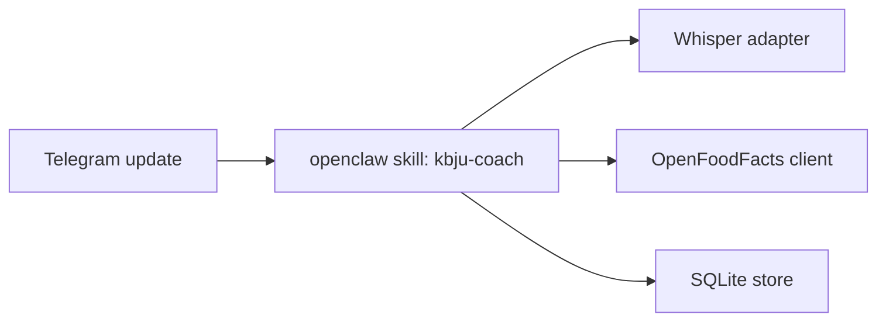

# ARCH-XXX: <Title>

## 0. Recon Report (Phase 0 — MANDATORY before any design)

> Required input: `docs/knowledge/openclaw.md`, `docs/knowledge/awesome-skills.md`. Reviewer rejects ArchSpecs that skip this section.

### 0.1 OpenClaw capability map
<Which openclaw built-ins close which PRD requirement (Telegram channel, voice transcription, scheduling, sandbox, model failover, etc.)? Cite skill anatomy or doc URL for each claim.>

### 0.2 Skill audit (awesome-openclaw-skills)
| Candidate skill (URL) | Matches which PRD §/Goal | Verdict | Rationale |
|---|---|---|---|
| <skill-name (link)> | <PRD-XXX@X.Y.Z §N / G1> | fork \| reference \| reject | <1-line trade-off vs writing from scratch> |

Minimum verdict requirements:
- Audit ≥3 candidates per major capability (KBJU calculation, voice transcription, photo recognition, summary generation).
- Explicitly state which capabilities have **no** suitable candidate and must be written.

### 0.3 Build-vs-fork-vs-reuse decision summary
<One paragraph: which capabilities we fork (and why), which we reference (read source for inspiration), which we build from scratch. This drives ADR-0NN choices below.>

## 1. Context
Implements: PRD-XXX@X.Y.Z, sections <list>.
Does NOT implement: PRD-XXX@X.Y.Z §3 Non-Goals.

### 1.1 Trace matrix
| PRD section | PRD Goal / US | Components that satisfy it |
|---|---|---|
| §2 G1 | … | C1, C2 |
| §5 US-1 | … | C2 |

Every PRD Goal MUST appear. Every component MUST trace back to ≥1 PRD row.

## 2. Architecture Overview
<Prose + Mermaid diagram.>



## 3. Components
### 3.1 <Component name>
- Responsibility: <1 sentence>
- Inputs:...
- Outputs:...
- LLM usage: none | <model, purpose>
- State: stateless | <where stored>
- Failure modes: <external API down / LLM timeout / rate-limited / malformed input / concurrent invocation>

### 3.2...

## 4. Data Flow
<Step-by-step; what data is produced where.>

## 5. Data Model / Schemas (declarative — no runnable code)
```yaml
EntityName:
  id: uuid
  field: type
```

## 6. External Interfaces
| System | Protocol | Auth | Rate limit | Failure mode |
|---|---|---|---|---|
| Telegram Bot API | HTTPS | bot token | 30 msg/s/chat | retry w/ backoff |
| OpenFoodFacts | HTTPS | none | ≈100 req/min | cache + LLM fallback |
| Whisper | HTTPS | API key | 50 req/min (OpenAI) | local fallback in v0.2 |

## 7. Tech Stack Decisions (linked ADRs)
- Language / runtime: <choice> — `ADR-XXX@X.Y.Z`
- Storage: <choice> — `ADR-XXX@X.Y.Z`
- Voice transcription: <choice> — `ADR-XXX@X.Y.Z`
- Photo recognition (v0.1): <choice> — `ADR-XXX@X.Y.Z`
- LLM routing: OmniRoute → Fireworks pool — `ADR-XXX@X.Y.Z`
- Deployment: <choice> — `ADR-XXX@X.Y.Z`

## 8. Observability
- Logs: format, where collected
- Metrics: what + endpoint
- Tracing: yes/no + tool

## 9. Security
- Secrets management: <where>
- Network boundaries: <what's exposed>
- LLM prompt-injection mitigations: <concrete; "sanitise inputs" alone is rejected>
- PII handling: <retention, deletion path>

## 10. Deployment
- Runtime: openclaw skill image, Docker Compose on VPS
- Resource budget: <CPU/RAM — must fit PRD Technical Envelope>
- Rollback procedure: <actual command sequence, not "revert to previous version">

## 11. Work Breakdown (tickets for Executor)
| ID | Title | Depends on | Assigned executor |
|---|---|---|---|
| TKT-XXX | … | — | executor |

## 12. Risks & Open Questions
- R1:...
- Q_TO_BUSINESS_1:... ← escalation upstream

---

## Handoff Checklist
- [ ] §0 Recon Report present, ≥3 candidates audited per major capability
- [ ] Trace matrix covers every PRD Goal
- [ ] Each component has clear Inputs / Outputs / failure modes
- [ ] All referenced ADRs exist and are `proposed` or `accepted`
- [ ] Resource budget fits PRD Technical Envelope (numeric check)
- [ ] Work Breakdown lists ≥3 atomic tickets with explicit dependency graph
- [ ] §8, §9, §10 are non-empty with concrete choices
- [ ] All PRD/ADR references pin to a specific version (`@X.Y.Z`)
- [ ] No production code in this file (schemas in §5 are declarative YAML only)
